## Introdução

Vamos começar o estudo de [vetores]{.text-red}.

Na Física, as grandezas podem ser classificadas como escalares e vetoriais.

- Grandezas escalares são dadas por um número, por exemplo: distância, área, massa, etc.
- Grandezas vetoriais são dadas por um vetor que tem módulo, direção e sentido. São exemplos: velocidade, força peso, força resultante, etc.

Como o módulo de um vetor é um número, para saber o que é um vetor, precisamos refletir primeiramente:

[O que é número?]{.bg-yellow}

## O que é o número cinco?

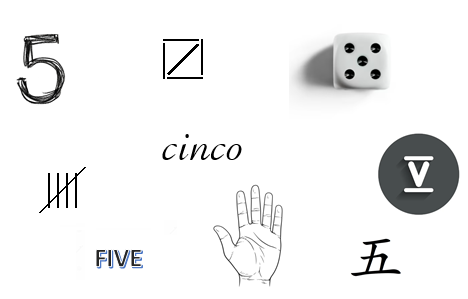{.nostretch width=60% fig-align="center"}

## O que é o número cinco? (cont.)

{.nostretch width=60% fig-align="center"}

- O número cinco é um conceito abstrato, representado de diferentes maneiras. 
- Nenhuma dessas imagens é o número cinco; são representações do número cinco. 

## Vetores

- Vetores também são conceitos abstratos. 
- São representados por segmentos orientados. 
- Segmentos orientados paralelos, com mesmo comprimento e sentido, representam o mesmo vetor. 

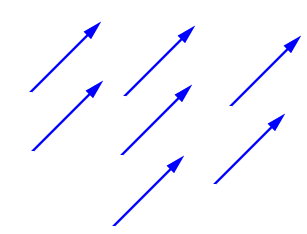{.nostretch width=40% fig-align="center"}

Do mesmo modo que a representação de um número não é o número, a representação de um vetor por um segmento orientado não é o vetor.

## Operações com vetores — Soma

[Soma]{.bg-yellow}: regra do paralelogramo. 

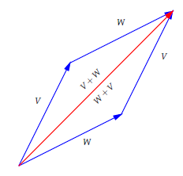{.nostretch width=30% fig-align="center"}

Na figura, vemos que a soma de vetores é comutativa: $V + W = W + V$. 

## Operações com vetores — Associatividade

A soma de vetores também é associativa: $(V+W)+U = V+(W+U)$. 

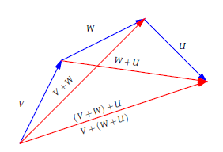{.nostretch width=50% fig-align="center"}

## Operações com vetores — Vetor nulo e simétrico

O vetor nulo $\vec{0}$ é representado por um ponto (mesmo ponto inicial e final).

- Elemento neutro da soma: $V + \vec{0} = V$. 
- Dado $V$, o [simétrico]{.bg-yellow} é $-V$ (mesma direção, sentido contrário) e $V + (-V) = \vec{0}$. 

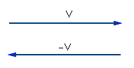{.nostretch width=30% fig-align="center"}

## Operações com vetores — Diferença

[Diferença]{.bg-yellow}: $V - W = V + (-W)$. 

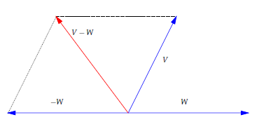{.nostretch width=50% fig-align="center"}

## Operações com vetores — Diagonais

Dados $V$ e $W$, as diagonais do paralelogramo gerado por eles são a soma e a diferença. 

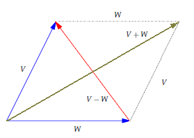{.nostretch width=50% fig-align="center"}

## Operações com vetores — Multiplicação por escalar

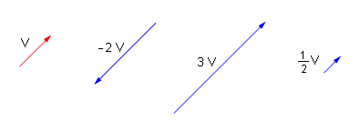{.nostretch width=50% fig-align="center"}

- Se dois vetores são múltiplos escalares, então são representados por segmentos orientados paralelos. 
- Reciprocamente, se representados por segmentos orientados paralelos, então um é múltiplo escalar do outro. 

## Exercício 1

Mostre que o segmento que une os pontos médios de dois lados de um triângulo é paralelo e tem metade do comprimento do terceiro lado. 

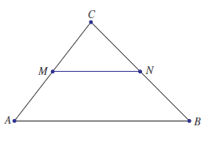{.nostretch width=50% fig-align="center"}

## Exemplo 2

Mostre que as diagonais de um paralelogramo se cortam ao meio. 

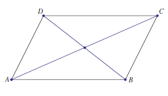{.nostretch width=50% fig-align="center"}

## Exemplo 2 — Solução

Seja $ABCD$ um paralelogramo. Defina $V = \overrightarrow{AB}$ e 
$W = \overrightarrow{AD}$. Então:

- $\overrightarrow{AC} = V + W$;
- $\overrightarrow{BD}= -V + W$.

Sejam $M_{AC}$ e $M_{BD}$ is pontos médios nas diagonais $AC$ e $BD$. Ora, 
\begin{align*}
\overrightarrow{AM_{AC}}&=\frac 12\overrightarrow{AC}=\frac{V+W}{2}\\
\overrightarrow{AM_{BD}}&=\overrightarrow{AB}+\frac 12\overrightarrow{BD}=V+\frac{-V+W}{2}=\frac{V+W}{2}.
\end{align*}

Isso quer dizer que o vetor com ponto inicial em $A$ e ponto final em $M_{AC}$ é o mesmo 
que o vetor com ponto inicial em $A$ e ponto final em $M_{BD}$. Logo, $M_{AC}=M_{BD}$ e as diagonais se cortam ao meio.

## Vetores em coordenadas

{.nostretch width=40% fig-align="center"}

Por definição, as coordenadas de um vetor são as coordenadas do ponto final do seu representante com ponto inicial na origem. 

[Isso é muito importante:]{.bg-yellow} para pegar as coordenadas, represente o vetor por um segmento orientado saindo da origem. 

## Operações de vetores em coordenadas

Se $V=(v_1,v_2)$ e $W=(w_1,w_2)$, então
$$
V+W = (v_1 + w_1,\ v_2 + w_2), \qquad \alpha V = (\alpha v_1,\ \alpha v_2).
$$ 

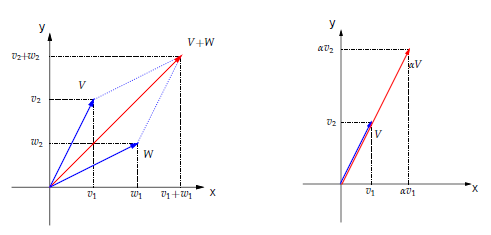{.nostretch width=70% fig-align="center"}

## O vetor que liga dois pontos no plano

Dados dois pontos $P$ e $Q$ no plano, determinar as coordenadas do vetor $\overrightarrow{PQ}$. 

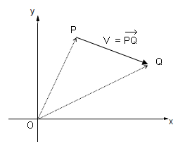{.nostretch width=30% fig-align="center"}

$$
\overrightarrow{OP} + \overrightarrow{PQ} = \overrightarrow{OQ}
\;\Rightarrow\; \overrightarrow{PQ} = \overrightarrow{OQ} - \overrightarrow{OP}.
$$ 

::: {.bg-yellow}
$$
\overrightarrow{PQ} = (\text{ponto final}) - (\text{ponto inicial}).
$$
:::

## O vetor que liga dois pontos no plano (exemplo)

Se $P=(2,4)$ e $Q=(5,2)$, então 
$$ 
\overrightarrow{PQ} = \overrightarrow{OQ} - \overrightarrow{OP} =  Q-P=
(5,2) - (2,4) = (3,-2).
$$

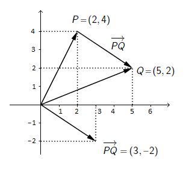{.nostretch width=35% fig-align="center"}

Observe o representante de $\overrightarrow{PQ}$ saindo da origem. 

## Exercícios no plano cartesiano

1. Os pontos $P=(3,7)$, $Q=(5,11)$ e $R=(7,16)$ são colineares? 
2. Dados $A=(x_1,y_1)$ e $B=(x_2,y_2)$, mostre que o ponto médio de $AB$ é $M=\big(\tfrac{x_1+x_2}{2},\tfrac{y_1+y_2}{2}\big)$. 
3. Considere $A = (-2,1)$ e $B = (10,7)$. Determine $C$ e $D$ que dividem o segmento $AB$ em três partes iguais. 
4. Dados $A=(-1,3)$, $B=(3,2)$ e $C=(5,4)$, determine $D$ tal que $ABCD$ são vértices consecutivos de um paralelogramo. 

## Plano cartesiano e sistemas de coordenadas no espaço

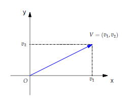{.nostretch width=50% fig-align="center"}

## Plano cartesiano e sistemas de coordenadas no espaço (cont.)

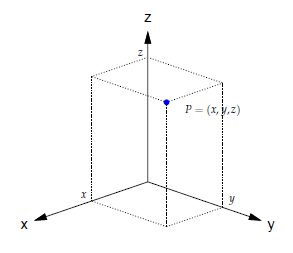{.nostretch width=40% fig-align="center"}

## Plano cartesiano e sistemas de coordenadas no espaço (cont.)

{.nostretch width=40% fig-align="center"}

No plano ou no espaço, as coordenadas de um vetor são as coordenadas do seu ponto final, quando representamos o vetor por um segmento orientado saindo da origem. 

## Norma = comprimento

Se $V=(v_1,v_2)$, então $\lVert V \rVert = \sqrt{v_1^2 + v_2^2}$. 

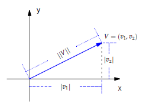{.nostretch width=50% fig-align="center"}

## Norma = comprimento (cont.)

Se $V=(v_1,v_2,v_3)$, então $\lVert V \rVert = \sqrt{v_1^2 + v_2^2 + v_3^2}$. 

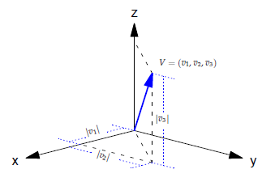{.nostretch width=50% fig-align="center"}

## Distância entre dois pontos

Se $P=(x_1,y_1)$ e $Q=(x_2,y_2)$, então

$$\overrightarrow{PQ}=Q-P=(x_2-x_1 , y_2-y_1), \qquad
\operatorname{dist}(P,Q)=\lVert\overrightarrow{PQ}\rVert=\sqrt{ (x_2-x_1)^2 + (y_2-y_1)^2 }.$$

{.nostretch width=40% fig-align="center"}

## Vetores unitários

Se $\alpha\in\mathbb{R}$ e $V$ é um vetor, então $\lVert\alpha V\rVert = |\alpha|\,\lVert V\rVert$ (por exemplo, $\lVert-2V\rVert = 2\lVert V\rVert$).

Um vetor $V$ é [unitário]{.bg-yellow} se $\lVert V\rVert = 1$. 

Se $V\neq\vec{0}$, então existe um vetor unitário na mesma direção e sentido de $V$:
$$U\;=\;\Big(\tfrac{1}{\lVert V\rVert}\Big)\,V.$$

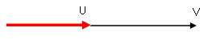{.nostretch width=50% fig-align="center"}

## Vetores unitários — exercícios

- Determine um vetor unitário na direção da reta $y=2x$. Quantos existem? 
- Determine um vetor unitário na direção da reta $y=-\tfrac{1}{2}x$. Quantos existem? 
- Todo vetor unitário no plano é da forma $U=(\cos\theta,\sin\theta)$. Interprete. 
- Determine um vetor unitário na direção da reta que liga $P=(-1,2,4)$ e $Q=(3,5,1)$. 

## Produto escalar

O produto escalar entre dois vetores $V$ e $W$ é o número real
$$\langle V,W\rangle = \lVert V\rVert\,\lVert W\rVert\,\cos\theta,$$
onde $\theta$ é o ângulo entre $V$ e $W$.

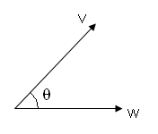{.nostretch width=30% fig-align="center"}

Além disso, $\langle V,W\rangle = 0$ se $V=\vec{0}$ ou se $W=\vec{0}$. 

## Produto escalar — exemplo

Se $V=(4,1)$ e $W=(2,3)$, então $\langle V,W\rangle = \lVert V\rVert\,\lVert W\rVert\,\cos\theta = \sqrt{17}\,\sqrt{13}\,\cos\theta$. 

Mas como determinar $\theta$? E no espaço? 

## Lei dos Cossenos

Para calcular $\theta$ e, portanto, o produto escalar, use a [Lei dos Cossenos]{.bg-yellow}: 
$$a^2=b^2+c^2-2bc\cos\theta.$$

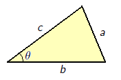{.nostretch width=35% fig-align="center"}

Daqui, 
$$
bc\cos\theta=\frac 12 (b^2+c^2-a^2)
$$

## Calcular produto escalar usando a Lei dos Cossenos

Sejam $V=(v_1,v_2)$ e $W=(w_1,w_2)$ vetores e seja $\vartheta$ os seus ângulos. 
\begin{align*}
\left<V,W\right>&=\|V\|\|W\|\cos(\vartheta)=\frac 12 (\|V\|^2+\|W\|^2-\|W-V\|^2)\\
&=\frac 12 (v_1^2+v_2^2+w_1^2+w_2^2-(w_1-v_1)^2-(w_2-v_2)^2)\\
&=\frac 12(v_1^2+v_2^2+w_1^2+w_2^2-(w_1^2-2v_1w_1+w_1^2)-(w_2^2-2v_2w_2+v_2^2))\\
&=v_1w_1+v_2w_2.
\end{align*}

Logo

::: {.bg-yellow}
$$
\left<V,W\right>=v_1w_1+v_2w_2
$$
:::

e não precisa saber o ângulo.

## Produto escalar em coordenadas — teoremas

No plano, se $V=(v_1,v_2)$ e $W=(w_1,w_2)$, então
$$\langle V,W\rangle = v_1w_1 + v_2w_2.$$

No espaço, se $V=(v_1,v_2,v_3)$ e $W=(w_1,w_2,w_3)$, então
$$\langle V,W\rangle = v_1w_1 + v_2w_2 + v_3w_3.$$

## Produto escalar — exemplo rápido

Se $V=(4,1)$ e $W=(2,3)$, então $\langle V,W\rangle = 4\cdot 2 + 1\cdot 3 = 11$. 

## Ângulo entre dois vetores

Se $V$ e $W$ são dados em coordenadas, então
$$\cos\theta\;=\;\dfrac{\langle V,W\rangle}{\lVert V\rVert\,\lVert W\rVert}.$$

O ângulo $\theta$ entre dois vetores satisfaz $0^\circ\leq\theta\leq 180^\circ$. 

## Ângulo entre dois vetores — exemplo

Se $V=(4,1)$ e $W=(2,3)$, então
$$\cos\theta=\dfrac{11}{\sqrt{17}\,\sqrt{13}},\qquad \theta = \arccos\Big(\dfrac{11}{\sqrt{17}\,\sqrt{13}}\Big) \approx 42^\circ.$$ 

## Classificação pelo produto escalar

Para $V,W\neq\vec{0}$:

1. $\theta$ é agudo se $\langle V,W\rangle > 0$; 
2. $\theta$ é obtuso se $\langle V,W\rangle < 0$; 
3. $\theta=90^\circ$ se $\langle V,W\rangle = 0$ (vetores perpendiculares ou ortogonais). 

Assim, $\langle V,W\rangle = 0$ determina a ortogonalidade de $V$ e $W$. 

## Exemplo: rotação de $90^\circ$ no plano

Dado $V=(a,b)$, o vetor $W=(-b,a)$ é obtido de $V$ por rotação de $90^\circ$ anti-horária:

Observe que 
$$
\lVert V\rVert = \lVert W\rVert\quad \mbox{e} \quad\langle V,W\rangle = -ab + ab = 0
$$ 
e $V$ e $W$ são ortogonais.

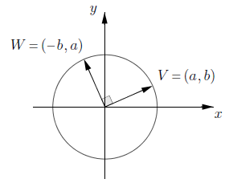{.nostretch width=40% fig-align="center"}

## Exercícios

1. Mostre que $A=(3,0,2)$, $B=(4,3,0)$ e $C=(8,1,-1)$ são vértices de um triângulo retângulo. Calcule a área. 
2. No cubo unitário $ABCDEFGH$, determine: 
  - o ângulo entre duas diagonais do cubo; são perpendiculares? 
  - o ângulo entre uma aresta e uma diagonal do cubo; é o mesmo para qualquer escolha? 

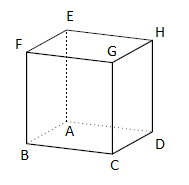{.nostretch width=30% fig-align="center"}

## Propriedades do produto escalar

1. $\langle V,W\rangle = \langle W,V\rangle$. 
2. $\langle U,V+W\rangle = \langle U,V\rangle + \langle U,W\rangle$. 
3. $\alpha\,\langle V,W\rangle = \langle \alpha V,W\rangle = \langle V,\alpha W\rangle$. 

Relação com matrizes: se $V$ e $W$ são colunas, 
$$\langle V,W\rangle = V^{T}W = \begin{bmatrix} v_1 & v_2 & v_3 \end{bmatrix}\!\begin{bmatrix} w_1 \\ w_2 \\ w_3 \end{bmatrix} = v_1w_1 + v_2w_2 + v_3w_3.$$ 
