## Retas no plano

<!-- The first part comes from Chico's aula10 -->

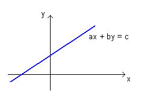{width=40% fig-align="center" .nostretch}

No plano cartesiano, toda reta tem equação do tipo 
$$
ax+by=c.
$$

Já estamos acostumados com isso.

## Retas no espaço

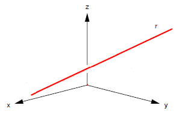{width=40% fig-align="center" .nostretch}

Qual é a equação de uma reta no espaço?

Faz sentido pensar que esta reta poderia ter uma equação do tipo $ax+by=c$ ou, generalizado, do tipo $ax+by+cz=d$.

[Não.]{.bg-yellow} Pois uma reta é um objeto 1-dimensional. E cada uma destas equações possuem duas variáveis livres.

## Exemplo 

No espaço, no sistema de coordenadas $xyz$, desenhe o conjunto solução da equação $x+y=2$.

:::{layout="[[50,50]]" layout-valign="bottom"}
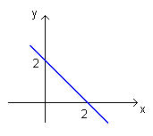{width=400}

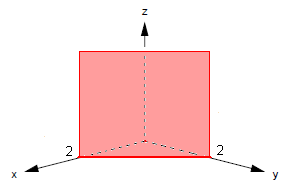{width=400}
:::

Como $z$ é variável livre, $x+y=2$ é um plano paralelo ao eixo $z$.

## A reta que passa por dois pontos — ideia

Sejam $P_0=(x_0,y_0,z_0)$ e $P_1=(x_1,y_1,z_1)$ dois pontos no espaço.
Vamos determinar a equação dos pontos $P=(x,y,z)$ que pertencem à reta $\overleftrightarrow{P_0P_1}$.

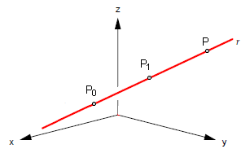{width=40% fig-align="center" .nostretch}

## A reta que passa por dois pontos — paralelismo

{width=40% fig-align="center" .nostretch}

$P$ pertence à reta $r$ se os vetores $\overrightarrow{P_0P}$ e $\overrightarrow{P_0P_1}$ são paralelos.

Ou seja,  se estes vetores são múltiplos escalares: $\overrightarrow{P_0P} = t\overrightarrow{P_0P_1}$ para algum $t\in\mathbb{R}$.

Isto é, $P - P_0 = t\overrightarrow{P_0P_1}$, ou ainda

$$P = P_0  + t\overrightarrow{P_0P_1}.$$

## A reta que passa por dois pontos — notação vetorial

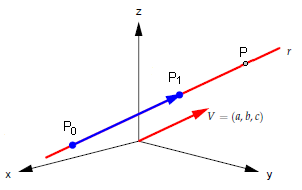{width=40% fig-align="center" .nostretch}

Se $V=\overrightarrow{P_0P_1}$, então $P= P_0 + tV$ (movimento retilíneo uniforme).

Esta é a [equação paramétrica]{.bg-yellow} da reta $r$.

Neste caso, $V$ é um [vetor diretor]{.bg-yellow} de $r$.

## Equação paramétrica da reta — forma coordenada

Se $P=(x,y,z)$, $P_0=(x_0,y_0,z_0)$ e $V=(a,b,c)$, então

$$\boxed{P= P_0 + tV}$$

significa que

$$(x,y,z) = (x_0,y_0,z_0) + t(a,b,c)$$

$$\begin{cases}
 x = x_0 + ta\\
 y = y_0 + tb\\
 z = z_0 + tc
\end{cases}$$

## Equação paramétrica — observações

$$\boxed{P= P_0 + tV}$$

$$\begin{cases}
 x = x_0 + ta\\
 y = y_0 + tb\\
 z = z_0 + tc
\end{cases}$$

A equação paramétrica de uma reta não é única.

- Podemos trocar o ponto inicial $P_0$ por qualquer outro ponto da reta.
- Podemos trocar o vetor diretor por qualquer múltiplo escalar.
- Sempre $V\neq \vec{0}$.

## Importante — reta como régua numérica

A equação paramétrica de uma reta $r$ faz uma associação biunívoca entre um ponto $P$ da reta e um número real $t$.

$$\boxed{P= P_0 + tV}$$

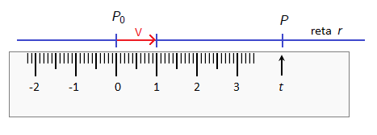{width=40% fig-align="center" .nostretch}

Com essa equação, podemos ver a reta $r$ como uma régua graduada, uma reta numérica, ou um eixo numérico orientado. O vetor diretor $V$ dá a direção e a unidade de medida dessa reta numérica.

## Exercícios

1. Escreva uma equação paramétrica para a reta que passa por $A=(-1,3,4)$ e que é paralela ao vetor $V=(1,-2,0)$.
2. Escreva uma equação paramétrica para a reta que passa por $M=(5,0,-3)$ e por $N=(3,8,7)$.
3. Considere o ponto $P=(4,-2,11)$ e a reta $r$ de equação $(x,y,z) = (1,-1,1) + t(3,1,2)$. Determine a equação da reta $s$ que passa por $P$ e que é perpendicular e concorrente com $r$.

## Exercício 3 -- solução

:::{.exr-}
Considere o ponto $P=(4,-2,11)$ e a reta $r$ de equação $(x,y,z) = (1,-1,1) + t(3,1,2)$. Determine a equação da reta $s$ que passa por $P$ e que é perpendicular e concorrente com $r$.
:::

O vetor diretor de $r$ é $V=(3,1,2)$. Procuramos um ponto $Q\in r$ tal que $\vec{PQ}\perp V$; ou seja, 
$\vec{PQ}\cdot v=0$. Tem-se $Q=(1,-1,1)+t(3,1,2)$:
\begin{align*}
(P-(1,-1,1)+t(3,1,2))\cdot v&=0\\
&⇒ [(4,-2,11)-(1+3t,\,-1+t,\,1+2t)]\cdot(3,1,2)=0\\
&⇒ (3-3t,\,-1-t,\,10-2t)\cdot(3,1,2)=28-14t=0\\
&⇒ t=2.
\end{align*}

Logo $Q=(7,1,5)$ e um vetor diretor de $s$ é $QP=(3,3,-6)=3(1,1,-2)$. Assim, a reta procurada é
$$
(x,y,z)=(4,-2,11)+u(1,1,-2), u∈ℝ,
$$
com $v·(1,1,-2)=3+1-4=0$ (perpendicular) e concorrente em $Q$.

## Posição relativa entre duas retas no espaço

:::{layout="[[33,33,33]]" layout-valign="bottom"}
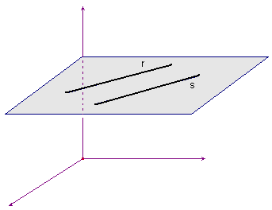

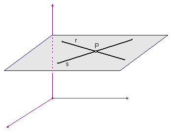

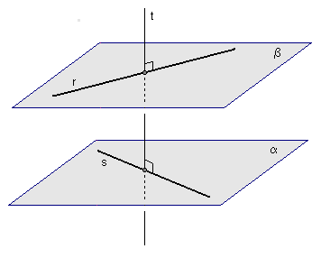
:::

Retas paralelas e concorrentes são [coplanares]{.bg-yellow}.

Retas reversas sempre moram em planos paralelos distintos $\alpha$ e $\beta$ tais que $s\subset\alpha$ e $r\subset\beta$.

## Retas reversas — construção auxiliar

Sempre existe uma reta $t$ perpendicular comum a $r$ e a $s$ interceptando $r$ e $s$. 

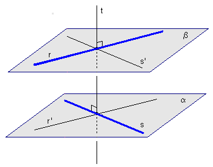{width=35% fig-align="center" .nostretch}

Observe a reta $r'$ paralela a $r$ traçada pelo ponto $s \cap t$ e também observe a reta $s'$ paralela a $s$ traçada por $r \cap t$.

- O plano $\alpha$ é o plano que contém as retas concorrentes $s$ e $r'$.
- O plano $\beta$ é o plano que contém as retas concorrentes $r$ e $s'$.

## Distância entre retas reversas

{width=40% fig-align="center" .nostretch}

Sejam $r$ e $s$ retas reversas, seja $t$ a reta perpendicular comum e sejam $P = r \cap t$ e $Q = s \cap t$. Então

$$\operatorname{dist}(r,s) = \operatorname{dist}(P,Q)$$

Esta é a menor distância entre um ponto de $r$ e um ponto de $s$.

## Exemplo — retas paralelas

1. Encontre a equação da reta $r$ que passa pelos pontos $A=(3,5,3)$ e $B=(1,1,1)$.
2. Considere $s$ a reta $(x,y,z) = (1,2,3)+ t(1,2,1)$. Verifique se as retas $r$ e $s$ são paralelas, reversas ou concorrentes.
3. Calcule a distância entre as retas $r$ e $s$.

## Exemplo -- solução

1. Um vetor diretor de $r$ é $\vec{AB} = (-2,-4,-2) = -2(1,2,1)$. Assim, uma equação paramétrica de $r$ é
  $(x,y,z) = (3,5,3) + t(1,2,1), t ∈ ℝ$.

2. As retas têm vetores diretores paralelos, logo são paralelas. Para ver que não coincidem, note que o ponto $(1,2,3)$ de $s$ não satisfaz a equação de $r$:
$$
3 + t = 1 ⇒ t = -2, \textrm{ mas } 5 + 2(-2) = 1 ≠ 2. 
$$

## Exemplo -- solução

3. [Distância entre duas retas paralelas.]{.bg-yellow} Seja $A=(3,5,3)\in r$ e $C=(1,2,3)\in s$. O vetor diretor das duas retas é $V=(1,2,1)$. Temos por Teorema de Pitágoras que 
$$
\|\vec{AC}\|^2=\operatorname{dist}(r,s)^2+\|\operatorname{proj}_V(\vec{AC})\|^2
$$ 

Temos que 

- $\vec{AC}=(-2,-3,0)$ e $\|\vec{AC}\|^2=13$;
- $\operatorname{proj}_V(\vec{AC})=\frac {\left<V,\vec{AC}\right>}{\|V\|^2}V=-8/6V=(-4/3,-8/3,-4/3) 
\Rightarrow \|\operatorname{proj}_V(\vec{AC})\|^2=32/3$

Logo 
$$
\operatorname{dist}(r,s)^2=\|\vec{AC}\|^2-\|\operatorname{proj}_V(\vec{AC})\|^2
=\frac{7}3 \textrm{ e } \operatorname{dist}(r,s)=\frac{\sqrt 7}{\sqrt 3}.
$$

## Exemplo — retas concorrentes

Considere a reta $r$ que passa pelos pontos $A=(5,4,1)$ e $B=(7,5,2)$. Também considere a reta $s$ que passa pelos pontos $P=(0,1,0)$ e $Q=(-3,-2,3)$.

1. Determine equações paramétricas das retas $r$ e $s$.
2. Mostre que $r$ e $s$ são retas concorrentes calculando o ponto $P = r \cap s$.

## Exemplo — retas reversas

Considere a reta $r$ que passa pelos pontos $A=(4,-2,1)$ e $B=(5,-3,2)$. Também considere a reta $s$ que passa pelos pontos $C=(1,7,4)$ e $D=(-7,-9,8)$.

1. Determine equações paramétricas das retas $r$ e $s$.
2. Verifique se as retas $r$ e $s$ são paralelas, concorrentes ou reversas.
3. Determine a distância entre $r$ e $s$ exibindo pontos $P\in r$ e $Q\in s$ tais que $\operatorname{dist}(r,s) = \operatorname{dist}(P,Q)$.

## Retas reversas -- solução

Sejam $A=(4,-2,1)$, $B=(5,-3,2)$, $C=(1,7,4)$ e $D=(-7,-9,8)$.

1. Equações paramétricas:
- $r: V_r = B-A = (1,-1,1) ⇒ (x,y,z) = A + t(1,-1,1)$.
- $s: V_s = D-C = (-8,-16,4)=-4(2,4,-1) ⇒ (x,y,z) = C + u(2,4,-1)$.

2. Posição relativa:
$V_r \not ∥ V_s$, logo não são paralelas. Tentando $r ∩ s$:
\begin{align*}
4+t &= 1+2u\\ 
-2-t &= 7+4u \\
1+t &= 4-u 
\end{align*} 
Das duas primeiras, $u=-1$ e $t=-5$; na terceira dá $1-5 ≠ 5$. Logo $r$ e $s$ são reversas.

## Distância entre retas reversas

3) Distância e pontos de mínima distância:
Tomando o segmento $PQ$ perpendicular a $r$ e $s$, com $P∈r$ e $Q∈s$:
\begin{align*}
(A + tV_r - (C + uV_s))·V_r &= 0\\
(A + tV_r - (C + uV_s))·V_s &= 0
\end{align*}

Com $A-C=(3,-9,-3)$, $\left<V_r,V_r\right>=3$, $\left<V_s,V_s\right>=21$, 
$\left<V_r,V_s\right>=-3$, $\left<V_r,(A-C)\right>=9$, 
$\left<V_s,(A-C)\right>=-27$, obtém-se
$t+u = -3$ e $t+7u = -9$ ⇒ $u=-1, t=-2$.

Logo,
$P = A + tV_r = (2,0,-1)$,
$Q = C + uV_s = (-1,3,5)$,
$PQ = Q-P = (-3,3,6) ⟂ V_r, V_s$.

Distância:
$‖PQ‖ = \sqrt{9+9+36} = 3\sqrt 6$.

<!-- end of Chico's aula10 -->

<!-- Chico's aula11 -->

## Planos no Espaço

Um plano pode ser dado de várias maneiras:

- Por 3 pontos não colineares passa um único plano.
- Por uma reta e por um ponto fora da reta.
- Dadas duas retas concorrentes.
- Dadas duas retas paralelas.
- Dado um ponto e uma reta, existe um único plano ortogonal à reta que passa por este ponto.

Algumas destas situações podem ser caracterizadas pelo produto escalar; outras, pelo produto vetorial.

Vamos começar discutindo a última situação.

## Planos, dado um ponto e um vetor normal

Seja dado um ponto $P_0=(x_0,y_0,z_0)$ e um vetor $N\neq\vec{0}$.

Existe um único plano $\alpha$ que passa por $P_0$ e que é ortogonal ao vetor $N$.

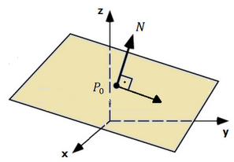{.nostretch width=40% fig-align="center"}

Nesta situação $N$ é um vetor normal ao plano.

## Planos, dado um ponto e um vetor normal (cont.)

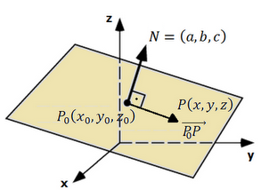{.nostretch width=35% fig-align="center"}

Um ponto $P=(x,y,z)$ pertence a este plano se os vetores $N=(a,b,c)$ e $\overrightarrow{P_0P}=(x-x_0,\,y-y_0,\,z-z_0)$ são perpendiculares:
$$
\langle N,\overrightarrow{P_0P}\rangle = 0 \;\Longleftrightarrow\; a(x-x_0)+b(y-y_0)+c(z-z_0)=0.
$$

Equivalente a
$$
ax+by+cz = a x_0 + b y_0 + c z_0.
$$

## Equação geral do plano

{.nostretch width=40% fig-align="center"}

Do item anterior, o lado direito é uma constante $d=a x_0 + b y_0 + c z_0$. Assim, um ponto $P=(x,y,z)$ pertence ao plano se e somente se

$$\boxed{\;ax + by + cz = d\;}$$

## Exemplo: plano por ponto e normal

Determine a equação geral do plano que passa por $P_0=(2,3,-4)$ e é ortogonal ao vetor $N=(5,-2,3)$.

Solução. A equação geral do plano é da forma $ax+by+cz=d$, em que os coeficientes $a$, $b$ e $c$ são as coordenadas de um vetor normal ao plano. Neste caso, a equação tem a forma $5x-2y+3z=d$. Substituindo o ponto $P_0=(2,3,-4)$, obtemos $d$:

$$5\cdot 2 - 2\cdot 3 + 3\cdot (-4) = d \;\Rightarrow\; d=-8.$$

Logo, a equação do plano é $\boxed{\;5x-2y+3z=-8\;}.$

## Observações sobre a equação geral do plano

$$\boxed{\;ax+by+cz=d\;}$$

- Para escrever a equação geral de um plano, precisamos de um vetor $N=(a,b,c)$ ortogonal ao plano (vetor normal), com $N\neq\vec{0}$.
- Em muitas situações, o vetor normal será calculado pelo produto vetorial.
- A equação geral do plano não é única: todo múltiplo não nulo de um vetor normal também é vetor normal. Multiplicar a equação $ax+by+cz=d$ por um número não nulo não altera o conjunto solução, apenas muda o vetor normal.

<!-- End of Chico's aula11 -->

<!-- Chico's Aula12 --> 

## Plano: ponto e vetor normal

{.nostretch width=35% fig-align="center"}

Se $P_0=(x_0,y_0,z_0)$ está em um plano e $N=(a,b,c)\neq\vec{0}$ é normal ao plano, então para $P=(x,y,z)$ no plano:
$$
\langle N,\overrightarrow{P_0P}\rangle=0 \;\Longleftrightarrow\; a(x-x_0)+b(y-y_0)+c(z-z_0)=0.
$$
Equivalente a $ax+by+cz = a x_0 + b y_0 + c z_0 = d$.

Equação geral do plano: $\boxed{\;ax+by+cz=d\;}.$

## Produto Vetorial em $\mathbb{R}^3$

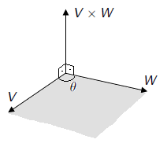{.nostretch width=35% fig-align="center"}

O produto vetorial $V\times W$ é caracterizado por:

- Norma: $\|V\times W\|=\|V\|\,\|W\|\,\operatorname{sen}(\theta)$.
- Direção: $V\times W$ é perpendicular ao plano de $V$ e $W$.
- Sentido: $V$, $W$ e $V\times W$ satisfazem a regra da mão direita.

## Produto vetorial em coordenadas

Se

$$\begin{aligned}
V &= (v_1,v_2,v_3) = v_1\,\vec{i}+v_2\,\vec{j}+v_3\,\vec{k},\\
W &= (w_1,w_2,w_3) = w_1\,\vec{i}+w_2\,\vec{j}+w_3\,\vec{k},
\end{aligned}$$

então, usando as propriedades do produto vetorial,

$$V\times W=\big(\,v_2w_3-v_3w_2\,,\; v_3w_1-v_1w_3\,,\; v_1w_2-v_2w_1\,\big).$$

É mais fácil memorizar pelo determinante simbólico

$$
V\times W=\det\!\begin{bmatrix}
\vec{i} & \vec{j} & \vec{k}\\
v_1 & v_2 & v_3\\
w_1 & w_2 & w_3
\end{bmatrix}.
$$

## Aplicação: plano por reta e ponto fora

Exemplo 1. Determine a equação do plano que passa por $A=(-1,2,1)$ e contém a reta

$$(x,y,z)=(2,1,3)+t(-1,3,1).$$

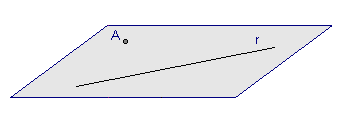{.nostretch width=40% fig-align="center"}

## Aplicação: plano por reta e ponto fora (ideia)

Observações importantes:

- Para calcular a equação $ax+by+cz=d$ precisamos de um vetor normal $N=(a,b,c)$ e de um ponto $P$ no plano.
- Se $V$ e $W$ são vetores paralelos ao plano, então $N=V\times W$ é um vetor normal do plano.
- Para achar $N$, basta identificar quaisquer dois vetores paralelos ao plano.

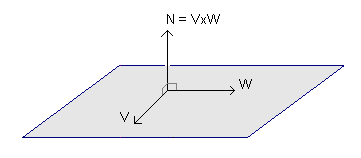{.nostretch width=40% fig-align="center"}

## Aplicação: plano por reta e ponto fora (cálculo)

No exemplo, $A=(-1,2,1)$ e $r:(x,y,z)=(2,1,3)+t(-1,3,1)$.

{.nostretch width=40% fig-align="center"}

O ponto $B=(2,1,3)$ pertence a $r$ e os vetores $\overrightarrow{BA}=(-3,1,-2)$ e $V_r=(-1,3,1)$ são paralelos ao plano. Então

$$
N=\overrightarrow{AB}\times V_r=
\begin{vmatrix}
\vec{i}&\vec{j}&\vec{k}\\
-3&1&-2\\
-1&3&1
\end{vmatrix}
=(7,5,-8).
$$

Logo, o plano tem equação $7x+5y-8z=d$.

## Aplicação: plano por reta e ponto fora (fechamento)

Como queremos que $r$ esteja contida no plano, todos os pontos de $r$ devem satisfazer a equação do plano. Um ponto genérico de $r$ é dado por

$$x=2-t,\quad y=1+3t,\quad z=3+t.$$

Substituindo em $7x+5y-8z=d$:

$$7(2-t)+5(1+3t)-8(3+t)=d\;\Rightarrow\; d=-5.$$

Portanto, o plano é $\boxed{\;7x+5y-8z=-5\;}.$

## Aplicação: plano do exemplo anterior

Exemplo 4. Determine a equação geral do plano que contém

$$A=(2,3,3),\quad B=(4,1,3),\quad C=(2,5,1),\quad D=(3,3,2).$$

Um vetor normal pode ser

$$N=\overrightarrow{AB}\times\overrightarrow{AC}=\begin{vmatrix}
\vec{i}&\vec{j}&\vec{k}\\
2&-2&0\\
0&2&-2
\end{vmatrix}=(4,4,4).$$

Logo, a equação é $4x+4y+4z=d$. Substituindo $B=(4,1,3)$, $d=16+4+12=32$, ou seja, $4x+4y+4z=32$, que simplifica para $\boxed{x+y+z=8}$.

## Aplicação: plano dado por 3 pontos

Exemplo 5. Determine a equação geral do plano que contém

$$A=(1,1,1),\quad B=(-2,3,3),\quad C=(2,3,1).$$

Um ponto $P=(x,y,z)$ pertence ao plano se os vetores são coplanares:

$$\overrightarrow{AP}=(x-1,y-1,z-1),\quad \overrightarrow{AB}=(-3,2,2),\quad \overrightarrow{AC}=(1,2,0).$$

Daí,

$$\det\!\begin{bmatrix}
x-1&y-1&z-1\\
-3&2&2\\
1&2&0
\end{bmatrix}=0.$$

Expandindo, obtém-se $\boxed{\;2x-y+4z=5\;}.$

## Aplicação: plano por duas retas concorrentes

Exemplo 6. Verifique se as retas são paralelas, concorrentes ou reversas. Se possível, determine o plano que contém as duas retas.

$$\begin{cases}
x=3+t\\
y=3+2t\\
z=4+t
\end{cases}
\qquad\qquad
\begin{cases}
x=-1+2s\\
y=-2+s\\
z=3-s
\end{cases}$$

## Aplicação: plano por duas retas paralelas

Exemplo 7.

1. Encontre a equação paramétrica da reta $r$ que passa por $A=(3,5,3)$ e $B=(1,1,1)$.

2. Considere $s:(x,y,z)=(1,2,3)+t(1,2,1)$. Verifique se $r$ e $s$ são paralelas, reversas ou concorrentes.

3. Ache, se possível, uma equação geral do plano que contém as retas $r$ e $s$.

<!-- End of Chico's aula12 -->

<!-- Begin og Chico's Aula13 -->

## Lista de exercícios 5: estudo de pontos, retas e planos

- Nesta aula serão discutidas dúvidas dos exercícios da Lista 8, sobre posições relativas de retas e planos e sobre o cálculo de ângulos e distâncias.
- Vai aproveitar mais quem já estudou e tentou resolver esses exercícios.
- Nosso foco não é memorizar e aplicar fórmulas. Em cada caso, devemos entender o problema e construir elementos que permitam a sua solução.

Tarefa de casa importante:

- Passe a limpo todas as soluções.
- Faça ilustrações de todas as situações.

## Posições relativas de dois objetos (ponto, reta, plano)

- Ex 1. Ponto - Ponto
- Ex 2. Ponto - Reta
- Ex 3. Ponto - Plano

Reta - Reta:

- Ex 4. Paralelas
- Ex 5. Concorrentes
- Ex 6. Reversas

Reta - Plano:

- Ex 7. Reta fura o plano num ponto
- Ex 8. Reta paralela ao plano
- Ex 9. Reta contida no plano

Plano - Plano:

- Ex 10. Paralelos
- Ex 11. Concorrentes

## Exemplo 1: ponto e ponto

Considere os pontos $A=(-1,3,2)$ e $B=(2,1,6)$.

1. (a) Determine a equação paramétrica da reta $\overleftrightarrow{AB}$.
2. (b) Calcule o ponto médio do segmento $AB$.
3. (c) Calcule $\mathrm{dist}(A,B)$.
4. (d) Determine o ponto simétrico $A'$ de $A$ em relação ao ponto $B$.
5. (e) Determine o ponto simétrico $B'$ de $B$ em relação ao ponto $A$.

## Exemplo 2: ponto e reta

Considere a reta $r$ de equação paramétrica $(x,y,z) = (-7,4,9) + t(-2,1,2)$ e o ponto $A=(7,4,5)$.

1. (a) O ponto $A$ pertence a reta $r$?
2. (b) Determine a equação do plano que contém $r$ e $A$.
3. (c) Determine a reta perpendicular a $r$ que passa por $A$.
4. (d) Calcule $\mathrm{dist}(A,r)$.
5. (e) Determine o ponto simétrico de $A$ em relação à reta $r$.

Obs: neste exemplo aprendemos a calcular a projeção ortogonal de um ponto em uma reta.

## Exemplo 3: ponto e plano

Considere o plano $\alpha$ de equação $x-2y+3z=4$ e o ponto $A=(2,8,-8)$.

1. (a) O ponto $A$ pertence ao plano $\alpha$?
2. (b) Determine a equação paramétrica da reta que passa por $A$ e é perpendicular ao plano $\alpha$.
3. (c) Calcule $\mathrm{dist}(A,\alpha)$.
4. (d) Determine o ponto simétrico de $A$ em relação ao plano $\alpha$.

Obs: neste exemplo aprendemos a calcular a projeção ortogonal de um ponto em um plano.

## Exemplo 4: duas retas paralelas

Considere as retas paralelas

$$r:\ (x,y,z) = (-6,3,-2) + t(3,-1,2)$$

$$s:\ (x,y,z) = (-3,30,-14) + s(3,-1,2)$$

1. (a) Determine a equação do plano $\alpha$ que contém $r$ e $s$.
2. (b) Dê um exemplo de uma reta perpendicular a $r$ e a $s$.
3. (c) Calcule $\mathrm{dist}(r,s)$.
4. (d) Determine uma reta contida em $\alpha$ e que está equidistante de $r$ e de $s$.

## Exemplo 5: duas retas concorrentes

Considere as retas

$$r:\ (x,y,z) = (7,2,-2) + t(-3,0,1)$$
$$s:\ (x,y,z) = (-1,1,2) + s(2,1,-2)$$

1. (a) Mostre que $r$ e $s$ são concorrentes calculando o ponto $P= r \cap s$.
2. (b) Determine a equação geral do plano que contém $r$ e $s$.
3. (c) Calcule o ângulo de $r$ e $s$.

Obs: neste exemplo aprendemos a calcular o ângulo entre duas retas.

## Exemplo 6: duas retas reversas

Considere as retas

$$r:\ (x,y,z) = (-1,-1,4) + t(1,1,-1)$$
$$s:\ (x,y,z) = (1,3,7) + s(-2,0,1)$$

1. (a) Mostre que $r$ e $s$ são retas reversas.
2. (b) Determine a equação da reta perpendicular e concorrente com $r$ e com $s$.
3. (c) Calcule $\mathrm{dist}(r,s)$ e o ângulo entre $r$ e $s$.
4. (d) Determine o plano $\alpha$ que contém $r$ e é paralelo a $s$.
5. (e) Determine o plano $\beta$ que contém $s$ e é paralelo a $r$.
6. (f) Determine o plano $\gamma$ que contém $r$ e é perpendicular a $\alpha$.
7. (g) Determine o plano $\omega$ que contém $s$ e é perpendicular a $\beta$.
8. (h) Determine a reta $\gamma \cap \omega$.

## Exemplo 6: ilustrações

{.nostretch width=40% fig-align="center"}

## Exemplo 6: ilustrações (cont.)

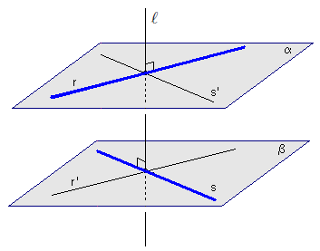{.nostretch width=40% fig-align="center"}

## Exemplo 6: ilustrações (cont.)

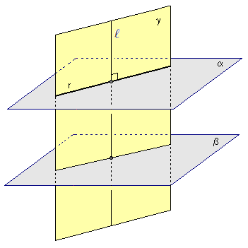{.nostretch width=40% fig-align="center"}

## Exemplo 6: ilustrações (cont.)

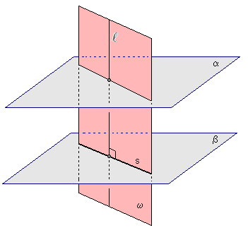{.nostretch width=40% fig-align="center"}

## Exemplo 6: ilustrações (cont.)

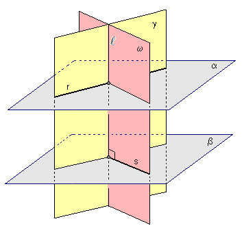{.nostretch width=40% fig-align="center"}

## Exemplo 7: reta furando um plano

Considere o plano $\alpha$ de equação $2x+y-z=4$ e a reta $r$ de equação $(x,y,z) = (0,3,-4) + t(1,-1,2)$.

1. (a) Determine o ponto $P = r \cap \alpha$.
2. (b) Determine o plano que contém $r$ e é perpendicular a $\alpha$.
3. (c) Determine a reta que é a projeção ortogonal de $r$ sobre $\alpha$.
4. (d) Calcule o ângulo entre $r$ e $\alpha$.
5. (e) Determine a reta contida em $\alpha$ e que é perpendicular a $r$.

Obs: neste exemplo aprendemos a calcular o ângulo entre uma reta e um plano.

## Exemplo 8: reta paralela a um plano

Considere o plano $\alpha$ de equação $x-y+z=1$ e a reta $r$ de equação $(x,y,z) = (0,3,1) + t(2,-1,-3)$.

1. (a) Mostre que a reta $r$ é paralela ao plano $\alpha$.
2. (b) Ache o plano que contém $r$ e é perpendicular a $\alpha$.
3. (c) Ache o plano que contém $r$ e é paralelo a $\alpha$.
4. (d) Determine a equação da reta que é a projeção ortogonal de $r$ sobre $\alpha$.
5. (e) Calcule $\mathrm{dist}(r,\alpha)$.

## Exemplo 9: reta contida em um plano

Considere o plano $\alpha$ de equação $x+2y-z=3$ e a reta $r$ de equação $(x,y,z) = (2,1,1) + t(2,1,4)$.

1. (a) Mostre que $r \subset \alpha$.
2. (b) Determine o plano que contém $r$ e que é perpendicular a $\alpha$.
3. (c) Dê um exemplo de uma reta contida em $\alpha$ e que é perpendicular a $r$.

## Exemplo 10: planos paralelos

Considere os planos

$$\alpha:\ 2x-y+z=1$$
$$\beta:\ 4x-2y+2z=5$$

1. (a) Mostre que $\alpha$ e $\beta$ são planos paralelos.
2. (b) Determine a reta perpendicular a $\alpha$ e a $\beta$ que passa pela origem.
3. (c) Calcule $\mathrm{dist}(\alpha,\beta)$.

## Exemplo 11: planos concorrentes

Considere os planos

$$\alpha:\ x-y+3z=1$$
$$\beta:\ 2x-3y-z=2$$

1. (a) Mostre que $\alpha$ e $\beta$ não são paralelos.
2. (b) Determine a equação da reta $\alpha \cap \beta$.
3. (c) Calcule o ângulo entre $\alpha$ e $\beta$.
4. (d) Dê um exemplo de um plano perpendicular a $\alpha$ e a $\beta$.

