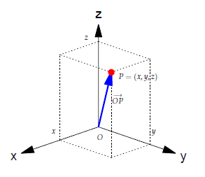
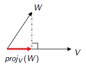

## O espaço $\mathbb{R}^n$ — $\mathbb{R}^2$

$\mathbb{R}^2$ = plano cartesiano

{.nostretch width=40% fig-align="center"}

:::{.bg-yellow}
$$
\mathbb{R}^2 = \{ (x_1,x_2)\mid x_1,x_2\in\mathbb{R} \}.
$$
:::

## O espaço $\mathbb{R}^n$ — $\mathbb{R}^3$

$\mathbb{R}^3$ = espaço tridimensional

{.nostretch width=40% fig-align="center"}

:::{.bg-yellow}
$$
\mathbb{R}^3 = \{ (x_1,x_2,x_3)\mid x_1,x_2,x_3\in\mathbb{R} \}.
$$
:::

## O espaço $\mathbb{R}^n$ — definição geral

Generalizando, o espaço [$\mathbb{R}^n$ é o conjunto formado por todas as coleções ordenadas $(x_1,x_2,\ldots,x_n)$]{.bg-yellow} de números reais.

$$
\mathbb{R}^n = \{ (x_1,x_2,\ldots,x_n)\mid x_1,x_2,\ldots,x_n\in\mathbb{R} \}.
$$

Um elemento $V=(x_1,x_2,\ldots,x_n)$ de $\mathbb{R}^n$ é um [vetor]{.bg-yellow}.

### Operações com vetores de $\mathbb{R}^n$

Se $V=(v_1,\ldots,v_n)$ e $W=(w_1,\ldots,w_n)$ são vetores de $\mathbb{R}^n$ e se $\alpha\in\mathbb{R}$, então:

- Soma: [$V+W=(v_1+w_1,\ldots,v_n+w_n)$]{.bg-yellow}.
- Multiplicação por escalar: [$\alpha V=(\alpha v_1,\ldots,\alpha v_n)$]{.bg-yellow}.

Estas operações satisfazem as propriedades já comentadas para o plano e para o espaço.

## Operações com vetores — forma matricial

Representando os vetores de $\mathbb{R}^n$ como matrizes coluna, as operações viram operações naturais com matrizes:

$$
V=\begin{bmatrix}v_1\\ \vdots \\ v_n\end{bmatrix},\quad
W=\begin{bmatrix}w_1\\ \vdots \\ w_n\end{bmatrix}.
$$

Soma: $V+W=\begin{bmatrix} v_1+w_1 \\ \vdots \\ v_n+w_n \end{bmatrix}$.

Multiplicação por escalar: $\alpha V=\begin{bmatrix} \alpha v_1 \\ \vdots \\ \alpha v_n \end{bmatrix}$.

## Combinação linear

Sejam $V_1,\ldots,V_k\in\mathbb{R}^n$. Uma [combinação linear]{.bg-yellow} destes vetores é um vetor

:::{.bg-yellow}
$$
V = x_1V_1 + x_2V_2 + \cdots + x_kV_k.
$$
:::

:::{#exm-}
Se $V_1=(-1,2,1)$ e $V_2=(3,-1,2)$ em $\mathbb{R}^3$ então

$$\begin{aligned}
V &= 3V_1 + 5V_2 = 3(-1,2,1) + 5(3,-1,2) = (-3,6,3) + (15,-5,10) = (12,1,13),\\
W &= 2V_1 - 3V_2 = 2(-1,2,1) - 3(3,-1,2) = (-2,4,2) - (9,-3,6) = (-11,7,-4).
\end{aligned}$$
:::

### Combinação linear — vetores canônicos

Em $\mathbb{R}^3$ todo vetor $V=(a,b,c)$ é combinação linear dos vetores canônicos

$$\vec{i}=(1,0,0),\quad \vec{j}=(0,1,0),\quad \vec{k}=(0,0,1).$$

De fato, $V=(a,b,c)=a\,\vec{i}+b\,\vec{j}+c\,\vec{k}$.

## Combinação linear — verificação por sistema linear

:::{#exm-}
Verifique se $V=(-10,-3,1)$ é combinação linear de $V_1=(1,-3,5)$ e $V_2=(-4,1,-3)$.

Basta analisar se $x_1V_1 + x_2V_2 = V$ tem solução:

$$
\begin{aligned}
x_1(1,-3,5) + x_2(-4,1,-3) &= (-10,-3,1)\\
(x_1-4x_2,\; -3x_1+x_2,\; 5x_1-3x_2) &= (-10,-3,1)
\end{aligned}
$$

Sistema equivalente:

$$
\begin{cases}
x_1 - 4x_2 = -10,\\
-3x_1 + x_2 = -3,\\
5x_1 - 3x_2 = 1.
\end{cases}
$$

Resolvendo, $x_1=2$ e $x_2=3$, logo $V=2V_1+3V_2$.
:::

## Combinação linear — forma matricial e proposição

No exemplo anterior, o sistema é

$$
\begin{bmatrix} 1 & -4 \\ -3 & 1 \\ 5 & -3 \end{bmatrix}
\begin{bmatrix} x_1 \\ x_2 \end{bmatrix}=
\begin{bmatrix} -10 \\ -3 \\ 1 \end{bmatrix}.
$$

Observe que as colunas das matrizes são $V_1$, $V_2$ e $V$. Generalizando:

:::{#prp-} 
Um vetor $V$ é combinação linear de $V_1,\ldots,V_k\in\mathbb{R}^n$ se o sistema linear $AX=V$ tem solução, onde $A$ é a matriz cujas colunas são $V_1,\ldots,V_k$.
:::

## Combinação linear — exemplo de inexistência

:::{#exm-}
Verifique se $V=(0,7,1)$ é combinação linear de $V_1=(2,1,4)$ e $V_2=(3,-2,5)$.

Analisar $xV_1 + yV_2 = V$:

$$
\begin{bmatrix} 2 & 3 \\ 1 & -2 \\ 4 & 5 \end{bmatrix}
\begin{bmatrix} x \\ y \end{bmatrix}=
\begin{bmatrix} 0 \\ 7 \\ 1 \end{bmatrix}
$$

Este sistema não tem solução; logo $V$ não é combinação linear de $V_1$ e $V_2$.
:::

## Subespaços

Uma coleção $X$ de vetores de $\mathbb R^n$ é dito [subespaço]{.bg-yellow} de $\mathbb R^n$ se $X$ é fechado para soma e múltiplo escalar. 
Isto é, se para quaisquer $U_1,U_2\in X$ e qualquer escalar $a\in\mathbb{R}$, os vetores 
$$
U_1 + U_2\quad\mbox{e}\quad a U_1
$$
também pertencem a $X$.

Se $X$ é subespaço de $\mathbb R^n$, então $X$ contém o vetor nulo $\vec{0}$ e  é fechado para combinações lineares. Ou seja, se $U_1,\ldots,U_k\in X$ e $a_1,\ldots,a_k\in\mathbb{R}$, então
$$
a_1 U_1 + a_2 U_2 + \cdots + a_k U_k \in X.
$$

## Exemplos de subespaços

:::{#exm-} 
1. Uma reta pela origem em $\mathbb R^2$ ou $\mathbb R^3$ é um subespaço de $\mathbb R^2$ ou $\mathbb R^3$.
2. Um plano pela origem em $\mathbb R^3$ é um subespaço de $\mathbb R^3$.
3. O conjunto $\{\vec{0}\}$ é um subespaço de $\mathbb R^n$.
4. O conjunto $\mathbb R^n$ é um subespaço de $\mathbb R^n$.
5. Se $A$ é matriz $m\times n$, o conjunto das soluções do sistema homogêneo $AX=\vec 0$ é um subespaço de $\mathbb R^n$.
:::

## Espaço gerado

Sejam $V_1,\ldots,V_k\in\mathbb R^n$. O [espaço gerado]{.bg-yellow} por $V_1,\ldots,V_k$ é o conjunto de todas as combinações lineares:

$$
[V_1,\ldots,V_k] = \{V=x_1V_1+\cdots+x_kV_k\mid x_1,\ldots,x_k\in\mathbb{R}\}.
$$

O conjunto $[V_1,\ldots,V_k]$ é um subespaço de $\mathbb R^n$.

[Observações importantes:]{.bg-yellow}

1. Como $\vec{0} = 0V_1+\cdots+0V_k$, a origem sempre pertence a um subespaço de $\mathbb{R}^n$;
2. Se $V,W\in [V_1,\ldots,V_k]$, então $V+W\in [V_1,\ldots,V_k]$ (fechado para soma);
3. Se $V\in [V_1,\ldots,V_k]$ and $a\in \mathbb R$, então $a V\in [V_1,\ldots,V_k]$ (fechado para múltiplo escalar).

## Exemplos

:::{#exm-}

- Gerado por um vetor não nulo: os múltiplos deste vetor (uma reta).
- Gerado por dois vetores não paralelos: o plano que contém estes vetores.
:::

:::{#exm-}
1. Determine a equação do plano $\alpha$ gerado por $V_1=(2,-1,1)$ e $V_2=(3,0,2)$.
2. O vetor $U=(5,-1,3)$ pertence a $\alpha$? Qual é o espaço gerado por $U,V_1,V_2$?
3. O vetor $W=(3,2,1)$ pertence a $\alpha$? Qual é o espaço gerado por $W,V_1,V_2$?
:::

## Espaço gerado — proposição útil

:::{#prp-}
Se $V_0$ é combinação linear de $V_1,\ldots,V_k$, então
$$
[V_0,V_1,\ldots,V_k] = [V_1,\ldots,V_k].
$$
:::

**Demonstração-esboço:** escreva $V_0=\alpha_1V_1+\cdots+\alpha_kV_k$ e substitua em $x_0V_0+x_1V_1+\cdots+x_kV_k$ para ver que qualquer combinação com $V_0$ pode ser reescrita sem $V_0$.

Para formar $[V_1,\ldots,V_k]$ podemos descartar qualquer vetor que seja combinação linear dos demais. Isso motiva o conceito de dependência linear:

:::{#def-}
Um conjunto de vetores é [linearmente dependente]{.bg-yellow} se algum deles é combinação linear dos demais. No caso contrário, dizemos que os vetores são [linearmente independentes]{.bg-yellow}.
:::

## Dependência linear — questões

- Como saber se um conjunto $\{V_1,\ldots,V_k\}$ é linearmente dependente? Tentar cada um por vez é viável?
- Se $\{V_1,\ldots,V_k\}$ é dependente, qual vetor é combinação dos demais? Poderiam todos ser combinações dos outros?

:::{#exr-}
1. Determine a equação do plano $\alpha$ gerado pelos vetores $V_1=(2,-1,1)$ e $V_2=(3,0,2)$.
2. O vetor $U = (1,-2,0)$ pertence a este plano $\alpha$? Qual é o espaço gerado por $U$, $V_1$ e $V_2$? Neste caso o subespaço $[U,V_1,V_2]$ é um plano pela origem.
3. O vetor $W = (3,2,1)$ pertence a este plano $\alpha$? Qual é o espaço gerado por $W$, $V_1$ e $V_2$? Neste caso o subespaço $[W,V_1,V_2]$ é todo o $\mathbb{R}^3$.
:::

## Dependência Linear

Um conjunto de vetores é linearmente dependente se um deles for uma combinação linear dos demais.

:::{#thm-}
Um conjunto de vetores $V_1,\ldots,V_k$ é linearmente dependente se e somente se a equação vetorial
$$
x_1V_1 + x_2V_2 + \cdots + x_kV_k = \vec{0}
$$
possui solução não trivial. Isto é, possui solução em que algum $x_i \neq 0$.
:::

De fato, por exemplo, se $x_1\neq 0$, na equação $x_1V_1 + x_2V_2 + \cdots + x_kV_k = \vec{0}$ podemos isolar $V_1$, escrevendo $V_1$ como uma combinação linear dos demais vetores:
$$
V_1 = -\dfrac{x_2}{x_1}V_2 - \cdots - \dfrac{x_k}{x_1}V_k.
$$

## Dependência Linear

:::{#exm-}
Verifique se os vetores $V_1=(1,2,5)$, $V_2=(7,-1,5)$ e $V_3=(1,-1,-1)$ são LI ou LD.

Resolvendo a equação $x_1V_1 + x_2V_2 + x_3V_3 = \vec{0}$, obtemos $2V_1 - V_2 + 5V_3 = \vec{0}$.

Neste caso, qualquer um destes vetores pode ser escrito como uma combinação linear dos outros dois.

Portanto $[V_1,V_2,V_3] = [V_1,V_2] = [V_1,V_3] = [V_2,V_3]$.

Este espaço gerado é um plano pela origem.
:::

## Dependência Linear

:::{#exm}
Verifique se os vetores $V_1=(3,0,-12)$, $V_2=(-1,2,1)$ e $V_3=(-2,0,8)$ são LI ou LD.

Neste exemplo $2V_1+0V_2+3V_3=\vec{0}$. Portanto

- podemos escrever $V_1$ como combinação linear de $V_2$ e $V_3$.
- e também podemos escrever $V_3$ como combinação linear de $V_1$ e $V_2$.
- mas não podemos escrever $V_2$ como combinação linear de $V_1$ e $V_3$.

Daí $[V_1,V_2,V_3] = [V_2,V_3] = [V_1,V_2]$. Este espaço é um plano.

Observe que $[V_1,V_3]$ é uma reta contida neste plano.
:::

## Dependência Linear

Obs: No exemplo anterior vimos que quando um conjunto de vetores é LD então um destes vetores é uma combinação linear dos demais. Entretanto, mesmo o conjunto sendo LD, pode ser que exista um vetor que não seja uma combinação linear dos demais.

Vimos que se $V_1,V_2,\ldots,V_k$ é um conjunto LD e se, por exemplo, $V_1$ é uma combinação linear dos demais vetores então

$$[V_1,V_2,\ldots,V_k] = [V_2,\ldots,V_k].$$

Para formar o espaço gerado não precisamos do vetor $V_1$. Podemos gerar este mesmo espaço com um vetor a menos.

Podemos continuar o processo, agora com os vetores $V_2,\ldots,V_k$, eliminando vetores que já são combinações lineares dos demais.

Após eliminar todos estes vetores, ficamos com um conjunto de vetores linearmente independete e que gera o mesmo espaço.

Neste momento, obtemos uma base para este subespaço.

## Base e Dimensão

Informalmente: Uma [base é um conjunto mínimo]{.bg-yellow} de geradores para um subespaço.

:::{#def-}
Seja $W$ um subespaço de $\mathbb R^n$. Uma [base]{.bg-yellow} para $W$ é um sistema de vetores 
$V_1,\ldots,V_k$ tais que 

1. $W = [V_1,\ldots,V_k]$ (ou seja, os vetores geram $W$ são combinações lineares destes vetores); e
2. $V_1,\ldots,V_k$ são linearmente independentes (ou seja, nenhum vetor é combinação linear dos demais).
:::

:::{#lem-}
Se $V_1,\ldots,V_k$ é base de $W$, então todo vetor de $W$ pode ser escrito de forma única como combinação linear de $V_1,\ldots,V_k$.
:::

Se $V\in W$ e 
$$
V=x_1V_1 + x_2V_2 + \cdots + x_kV_k
$$
então os escalares $x_1,\ldots,x_k$ são chamadas de [coordenadas]{.bg-yellow} de $V$ na base $V_1,\ldots,V_k$.

## Lema chave

:::{#lem-}
Seja $W=[V_1,\ldots,V_k]$ um subespaço de $\mathbb{R}^n$. Assuma que
$m>k$ e sejam $U_1,\ldots,U_m\in W$. Então  os vetores $U_1,\ldots,U_m$ são LD. 
:::
:::{.proof}
Como cada $U_j\in W=[V_1,\ldots,V_k]$, existem coeficientes $a_{ij}$ tais que
$$
U_j=\sum_{i=1}^k a_{ij}V_i,\qquad j=1,\ldots,m.
$$
Considere a matriz $A=(a_{ij})\in\mathbb{R}^{k\times m}$. Como $m>k$, o sistema homogêneo $A\,x=\vec{0}$ tem solução não trivial. Seja $x=(x_1,\ldots,x_m)\neq\vec{0}$ tal solução. Então
$$
\sum_{j=1}^m x_j U_j
=\sum_{j=1}^m x_j\Big(\sum_{i=1}^k a_{ij}V_i\Big)
=\sum_{i=1}^k\Big(\sum_{j=1}^m a_{ij}x_j\Big)V_i
=\sum_{i=1}^k 0\cdot V_i=\vec{0}.
$$
Logo, existe uma combinação linear não trivial dos $U_j$ que dá o vetor nulo, isto é, $U_1,\ldots,U_m$ são linearmente dependentes.
:::

## A dimensão

Consequência: Assuma que $W=[V_1,\ldots,V_k]=[U_1,\ldots,U_m]$ e que $V_1,\ldots,V_k$ e $U_1,\ldots,U_m$ 
são bases de $W$. Então $k=m$. 

:::{#def-}
Se a base tem $k$ vetores, dizemos que $W$ é um subespaço de [dimensão]{.bg-yellow} $k$:
$$
\dim(W)=k.
$$
:::

Se $\{V_1,\ldots,V_k\}$ é uma base para o subespaço $W$, então $W$ é o espaço gerado por estes vetores. Mais ainda, não existem "vetores sobrando". Não podemos descartar nenhum dos vetores da base.
$$
W = [V_1,\ldots,V_k].
$$

## Base e Dimensão

:::{#exm-}
1. No plano, $\{\vec{i},\vec{j}\}$ é uma base de $\mathbb{R}^2$.
2. De modo mais geral, quaisquer vetores não paralelos $V_1$ e $V_2$ formam uma base $\{V_1,V_2\}$ de $\mathbb{R}^2$.
3. No espaço, $\{\vec{i},\vec{j},\vec{k}\}$ é uma base de $\mathbb{R}^3$.
4.  Se $W$ é uma reta pela origem, e se $V_1\in W$ é um vetor não nulo, então $\{V_1\}$ é uma base para $W$.
5. Se $W$ é um plano pela origem e se $V_1$ e $V_2$ são dois vetores não paralelos em $W$, então $\{V_1,V_2\}$ é uma base de $W$.
:::

## Base e Dimensão

:::{#exm-}
6. Se $V_1$, $V_2$ e $V_3$ são vetores não coplanares, então $\{V_1,V_2,V_3\}$ é uma base de $\mathbb{R}^3$. Observe que este é o caso se, e somente se, $\det[V_1,V_2,V_3] \neq 0$.
7. Determine uma base para o plano de equação $2x+y-3x=0$. Em seguida complete esta base até uma base de $\mathbb{R}^3$.
8. Determine uma base e a dimensão do seguinte subespaço de $\mathbb{R}^3$
$$
W = \{ (a-b,\ b+c,\ 2a-b+c)\in\mathbb{R}^3\mid a,b,c\in\mathbb{R} \}.
$$
9. O conjunto solução de um sistema linear homogêneo é um subespaço de $\mathbb{R}^n$. Por exemplo, determine uma base para o conjunto solução de
$$
\left\{\begin{array}{rrrrrrrrr}
 x  & + &  y  & - & 2z & - &  w & = &  0 \\
-x  & - &  y  & + & 2z & + &  w & = &  0 \\
2x  & + & 2y  & - &  z & + &  w & = &  0 \\
\end{array}\right.
$$
:::

## Vetores LI e LD: caracterização via determinantes

Então os vetores $V_1,V_2,\ldots,V_k$ são LD quando o sistema linear $AX=\overline{0}$ tem solução não trivial, em que as colunas de $A$ são os vetores $V_1,V_2,\ldots,V_k$.

Se $k=n$, ou seja, se temos $n$ vetores em $\mathbb{R}^n$, a matriz $A$ é quadrada. Lembre-se que, neste caso, o sistema homogêneo $AX=\overline{0}$ tem solução não trivial somente quando $\det(A) = 0$ (a matriz $A$ não tem inversa).

Portanto, em $\mathbb{R}^n$:

- $V_1,V_2,\ldots,V_n$ são LD $\Leftrightarrow$ $\det(A) = 0$.
- $V_1,V_2,\ldots,V_n$ são LI $\Leftrightarrow$ $\det(A) \neq 0$.

## Produto escalar em $\mathbb{R}^n$

Se $V=(v_1,v_2,\ldots,v_n)$ e $W=(w_1,w_2,\ldots,w_n)$ são vetores em $\mathbb{R}^n$, o [produto escalar]{.bg-yellow} entre $V$ e $W$ é o número real

$$\langle V,W\rangle = v_1w_1 + v_2w_2 + \cdots + v_nw_n.$$

A norma do vetor $V$ é $\|V\| = \sqrt{v_1^2 + v_2^2 + \cdots + v_n^2} = \sqrt{\langle V,V\rangle}$.

Observe que isto é uma generalização das definições que já foram dadas e interpretadas para $\mathbb{R}^2$ e $\mathbb{R}^3$.

## Produto escalar em $\mathbb{R}^n$ — propriedades

São as mesmas que já foram demonstradas para o $\mathbb{R}^2$ e $\mathbb{R}^3$:

1. $\langle V,W\rangle = \langle W,V\rangle$.
2. $\langle U+V,W\rangle = \langle U,W\rangle + \langle V,W\rangle$.
3. $\langle \alpha V,W\rangle = \langle V,\alpha W\rangle = \alpha \langle V,W\rangle$.
4. $\langle V,V\rangle=\|V\|^2\ \geq\ 0$. Mais ainda, $\|V\|=0 \Leftrightarrow V=\vec{0}$.
5. $|\langle V,W\rangle|\ \leq\ \|V\|\,\|W\|$ (Cauchy–Schwarz).
6. $\|V+W\|\ \leq\ \|V\| + \|W\|$ (Desigualdade triangular).

## Cauchy–Schwarz e ângulo

Da [desigualdade de Cauchy–Schwarz]{.bg-yellow}, para $V,W\neq\vec{0}$,

$$\frac{|\langle V,W\rangle|}{\|V\|\,\|W\|}\ \leq\ 1 \quad\Rightarrow\quad -1\ \leq\ \frac{\langle V,W\rangle}{\|V\|\,\|W\|}\ \leq\ 1.$$

Existe um único $\theta\in[0,\pi]$ tal que

$$\cos\theta\ =\ \frac{\langle V,W\rangle}{\|V\|\,\|W\|}.$$

Chamamos $\theta$ de ângulo entre $V$ e $W$, e

$$\langle V,W\rangle = \|V\|\,\|W\|\cos\theta.$$

## Vetores ortogonais em $\mathbb{R}^n$

Para $V,W\neq\vec{0}$ em $\mathbb{R}^n$,

$$\langle V,W\rangle = \|V\|\,\|W\|\cos\theta.$$

Assim, $\langle V,W\rangle=0$ se, e somente se, $\theta=90^\circ$.

Portanto,

$$\boxed{\ \langle V,W\rangle=0\ \ \text{caracteriza vetores ortogonais}\ }$$

## Projeção ortogonal

{.nostretch width=30% fig-align="center"}

:::{.r-stack}
:::{.fragment .current-visible}
O vetor projeção ortogonal é caracterizado por:

- $\operatorname{proj}_V(W) = \alpha V$ é um múltiplo escalar de $V$.
- A diferença $W - \operatorname{proj}_V(W)$ é um vetor ortogonal a $V$.
:::

:::{.fragment .current-visible}
Temos 
$$
\langle W - \operatorname{proj}_V(W),V\rangle=0 \Rightarrow \langle W - \alpha V,V\rangle=0 \Rightarrow \langle W,V\rangle - \alpha\langle V,V\rangle=0,
$$
:::

:::{.fragment .current-visible}
logo

$$
\alpha = \dfrac{\langle W,V\rangle}{\langle V,V\rangle}, \qquad \boxed{\operatorname{proj}_V(W) = \dfrac{\langle W,V\rangle}{\langle V,V\rangle}\, V}.
$$
:::
:::

## Bases ortogonais e ortonormais

Seja $\{V_1,\ldots,V_k\}$ uma base para um subespaço de $\mathbb{R}^n$:

1. A [base é ortogonal]{.bg-yellow} se quaisquer dois vetores da base são ortogonais ($\langle V_i,V_j\rangle=0$).
2. A [base é ortonormal]{.bg-yellow} se todos os vetores são unitários e perpendiculares ($\langle V_i,V_j\rangle=0$ e $\langle V_i,V_i\rangle=1$).

Exemplos:

- $\{\vec{i},\vec{j},\vec{k}\}$ é uma base ortonormal de $\mathbb{R}^3$.
- $V_1=(1,3)$ e $V_2=(-3,1)$ formam uma base ortogonal de $\mathbb{R}^2$.
- $V_1=(\cos\theta,\operatorname{sen}\theta)$ e $V_2=(-\operatorname{sen}\theta,\cos\theta)$ formam uma base ortonormal de $\mathbb{R}^2$.

## Aplicação: coordenadas em base ortogonal

Se $\{V_1,\ldots,V_k\}$ é uma base ortogonal para um subespaço de $\mathbb{R}^n$ e se 
$$
V=x_1V_1+\cdots+x_kV_k,
$$ 
então

$$\langle V,V_j\rangle = x_j\langle V_j,V_j\rangle \quad\Rightarrow\quad \boxed{\ x_j = \dfrac{\langle V,V_j\rangle}{\langle V_j,V_j\rangle},\ j=1,\ldots,k\ }$$

## Bases ortogonais e ortonormais — exercícios

:::{#exr-}
1. Considere a base ortogonal de $\mathbb{R}^2$ formada por $V_1=(3,1)$ e $V_2=(-1,3)$. Se $V=(5,4)$ determine $x_1$ e $x_2$ tais que $V = x_1V_1 + x_2V_2$.

2. Considere a base ortonormal de $\mathbb{R}^2$ formada por $V_1=(\tfrac{4}{5},\tfrac{3}{5})$ e $V_2=(-\tfrac{3}{5},\tfrac{4}{5})$. Se $V=(5,4)$ determine $x_1$ e $x_2$ tais que $V = x_1V_1 + x_2V_2$.
3. Considere o subespaço $W$ de $\mathbb{R}^3$ que é o plano de equação $2x+y-3z=0$.
    
    a. Determine uma base de $W$.
    b. Determine uma base ortogonal $\{V_1,V_2\}$ de $W$.
    c. Determine uma base ortonormal $\{U_1,U_2\}$ de $W$.
    d. Se $V=(5,2,4)$, calcule $x_1$ e $x_2$ tais que $V=x_1V_1+x_2V_2$.
    e. Se $V=(5,2,4)$, calcule $c_1$ e $c_2$ tais que $V=c_1U_1+c_2U_2$.
:::

## Bases ortogonais e ortonormais — exercícios

:::{#exr-}
4. Considere o plano $\alpha$ de $\mathbb{R}^3$ de equação $x-2y+z=0$.
    
    a. Determine uma base ortogonal $\{V_1, V_2, V_3\}$ de $\mathbb{R}^3$ tal que $\{V_1,V_2\}$ é uma base ortogonal do plano $\alpha$.
    b. Escreva o vetor $V=(10,1,4)$ como uma combinação linear dos vetores da base do item (a): encontre $x,y,z$ tais que $xV_1+yV_2+zV_3=V$.

5. Sejam $V_1=(1,3,-2,5)$ e $V_2=(1,2,1,3)$ vetores de $\mathbb{R}^4$. Seja $W$ o conjunto dos vetores de $\mathbb{R}^4$ que são ortogonais a $V_1$ e a $V_2$.

    a. Determine uma base de $W$.
    b. Determine uma base ortogonal $\{W_1,W_2\}$ de $W$.
    c. Se $V=(-9,-4,2,5)$, mostre que $V\in W$ e calcule $x_1$ e $x_2$ tais que $V=x_1W_1+x_2W_2$.
:::

## Ortogonalização de Gram-Schmidt

Assuma que $V_1,V_2,\ldots,V_k$ são vetores LI em $\mathbb{R}^n$. O processo de [Ortogonalização de Gram-Schmidt]{.bg-yellow} constrói uma base ortogonal $U_1,U_2,\ldots,U_k$ para o mesmo espaço gerado por $V_1,V_2,\ldots,V_k$.

O processo é o seguinte:
\begin{align*}
U_1 & = V_1,\\
U_2 & = V_2 - \operatorname{proj}_{U_1}(V_2),\\
U_3 & = V_3 - \operatorname{proj}_{U_1}(V_3) - \operatorname{proj}_{U_2}(V_3),\\
& \ \vdots \\
U_k & = V_k - \operatorname{proj}_{U_1}(V_k) - \operatorname{proj}_{U_2}(V_k) - \cdots - \operatorname{proj}_{U_{k-1}}(V_k).
\end{align*}
Após obter a base ortogonal $U_1,U_2,\ldots,U_k$, podemos obter uma base ortonormal dividindo cada vetor pela sua norma:  

## Exemplo de Ortogonalização de Gram-Schmidt

:::{#exm-}
Considere os vetores $V_1=(1,1,0,0)$, $V_2=(1,0,1,1)$, $V_3=(0,1,1,0)$ em $\mathbb{R}^4$. Eles são LI. 
Aplicando Gram-Schmidt:
\begin{align*}
U_1 & = V_1 = (1,1,0,0),\\
U_2 & = V_2 - \operatorname{proj}_{U_1}(V_2) = (1,0,1,1) - \dfrac{\langle V_2,U_1\rangle}{\langle U_1,U_1\rangle} U_1 = (1,0,1,1) - \dfrac{1}{2}(1,1,0,0) = \left(\dfrac{1}{2}, -\dfrac{1}{2}, 1, 1\right),\\
U_3 & = V_3 - \operatorname{proj}_{U_1}(V_3) - \operatorname{proj}_{U_2}(V_3) \\
    & = (0,1,1,0) - \dfrac{\langle V_3,U_1\rangle}{\langle U_1,U_1\rangle} U_1 - \dfrac{\langle V_3,U_2\rangle}{\langle U_2,U_2\rangle} U_2 \\
    & = (0,1,1,0) - \dfrac{1}{2}(1,1,0,0) - \dfrac{1/2}{5/2}\left(\dfrac{1}{2}, -\dfrac{1}{2}, 1, 1\right) = \left(-\dfrac{3}{5}, \dfrac{3}{5}, \dfrac{4}{5}, -\dfrac{1}{5}\right).
\end{align*}
A base ortogonal é $\{U_1,U_2,U_3\}$.
:::

## O problema da mudança de base 

Seja $W$ um subespaço de $\mathbb{R}^n$ de dimensão $k$. Sejam 
$$
\mathcal{B}=\{V_1,\ldots,V_k\}\quad\mbox{e}\quad \mathcal{C}=\{U_1,\ldots,U_k\}
$$ 
duas bases de $W$. Então, para todo vetor $X \in W$, podemos escrever:
$$
X = x_1V_1 + x_2V_2 + \cdots + x_kV_k = c_1U_1 + c_2U_2 + \cdots + c_kU_k.
$$  

Os coeficientes $x_1,x_2,\ldots,x_k$ são as coordenadas de $X$ na base $\mathcal{B}$ e os coeficientes $c_1,c_2,\ldots,c_k$ são as coordenadas de $X$ na base $\mathcal{C}$.  

[**Problema:**]{.bg-yellow} Dadas as coordenadas $c_1,c_2,\ldots,c_k$ de $X$ na base $\mathcal{B}$, como encontrar as coordenadas $x_1,x_2,\ldots,x_k$ de $X$ na base $\mathcal{C}$?

## A matriz mudança de base

A [matriz de mudança de base]{.bg-yellow} de $\mathcal{B}$ para $\mathcal{C}$ é a matriz $P$ cujas colunas são as coordenadas dos vetores da base $\mathcal{C}$ na base $\mathcal{B}$

Ou seja, escreva 
$$
U_j = a_{1j}V_1 + a_{2j}V_2 + \cdots + a_{kj}V_k,\quad j=1,2,\ldots,k,
$$
então 
$$
P=\begin{bmatrix} a_{11} & a_{12} & \cdots & a_{1k} \\[6pt] a_{21} & a_{22} & \cdots & a_{2k} \\[6pt] \vdots & \vdots & \ddots & \vdots \\[6pt] a_{k1} & a_{k2} & \cdots & a_{kk} \end{bmatrix}.  
$$

Podemos escrever $P$ de forma compacta como
$$
P = [ [U_1]_{\mathcal{B}} \quad [U_2]_{\mathcal{B}} \quad \cdots \quad [U_k]_{\mathcal{B}} ].
$$

## Mudança de base — fórmula

Assim, se 
$$
\begin{bmatrix} 
x_1 \\ x_2 \\ \vdots \\ x_k\end{bmatrix}=[X]_{\mathcal{B}}\quad\mbox{e} \quad 
\begin{bmatrix} 
c_1 \\ c_2 \\ \vdots \\ c_k\end{bmatrix}=
[X]_{\mathcal{C}}
$$
são as matrizes coluna das coordenadas de $X$ nas bases $\mathcal{B}$ e $\mathcal{C}$, respectivamente, então
$$
\begin{bmatrix} 
x_1 \\ x_2 \\ \vdots \\ x_k\end{bmatrix}
 = P \begin{bmatrix} 
c_1 \\ c_2 \\ \vdots \\ c_k\end{bmatrix}.
$$
A matriz $P$ é invertível e sua inversa é a matriz de mudança de base de 
$\mathcal{C}$ para $\mathcal{B}$.

## Exemplo de mudança de base

:::{#exm-}
Sejam $W$ o plano de $\mathbb{R}^3$ de equação $x+y+z=0$, $\mathcal{B}=\{V_1=(1,-1,0), V_2=(1,0,-1)\}$ e $\mathcal{C}=\{U_1=(1,2,-3), U_2=(2,-1,-1)\}$ bases de $W$.  
Determine a matriz de mudança de base de $\mathcal{B}$ para $\mathcal{C}$ e as coordenadas do vetor $X=(-1,3,-2)$ na base $\mathcal{C}$.

:::{.r-stack}
:::{.fragment .current-visible}
Resolvendo o sistema
$$\begin{cases}
a(1,-1,0) + b(1,0,-1) = (1,2,-3), \\
c(1,-1,0) + d(1,0,-1) = (2,-1,-1),
\end{cases}$$
obtemos $U_1 = -2V_1 + 3V_2$ e $U_2 = V_1 + V_2$. Assim, a matriz de mudança de base de $\mathcal{B}$ para $\mathcal{C}$ é 
$$P = \begin{bmatrix} -2 & 1 \\[6pt] 3 & 1 \end{bmatrix}.$$
:::

:::{.fragment .current-visible}
$$P = \begin{bmatrix} -2 & 1 \\[6pt] 3 & 1 \end{bmatrix}.$$
Para encontrar as coordenadas de $X$ na base $\mathcal{B}$, primeiro encontramos as coordenadas de $X$ na base $\mathcal{C}$:
$$X = U_1 - U_2 \Rightarrow [X]_{\mathcal{C}} = \begin{bmatrix} 1 \\ -1 \end{bmatrix}.$$
:::
:::{.fragment}
Agora, usando a matriz de mudança de base, temos
$$[X]_{\mathcal{B}} = P [X]_{\mathcal{C}} = \begin{bmatrix} -2 & 1 \\[6pt] 3 & 1 \end{bmatrix} \begin{bmatrix} 1 \\ -1 \end{bmatrix} = \begin{bmatrix} -2 - 1 \\ 3 - 1 \end{bmatrix} = \begin{bmatrix} -3 \\ 2 \end{bmatrix}.$$
Portanto, as coordenadas de $X$ na base $\mathcal{B}$ são $\left(-3, 2\right)$.
:::
:::
:::

## Mudança de base — Rotação

Considere o plano $\mathbb{R}^2$ com a base canônica $\mathcal{B}=\{\vec{i},\vec{j}\}$ e a base $\mathcal{C}=\{U_1,U_2\}$, em que
$$
U_1=(\cos\theta,\sin\theta),\quad U_2=(-\sin\theta,\cos\theta).
$$

A matriz de mudança de base de $\mathcal{B}$ para $\mathcal{C}$ é   
$$
\begin{bmatrix}
\cos\theta & -\sin\theta \\
\sin\theta & \cos\theta
\end{bmatrix}
$$

:::{.r-stack}
:::{.fragment .current-visible}
Se $V=(x',y')$ são as coordenadas de um vetor na base $\mathcal{C}$, então as coordenadas $(x,y)$ de $V$ na base $\mathcal{B}$ são dadas por
$$
\begin{bmatrix}
x \\ y
\end{bmatrix}
=
\begin{bmatrix}
\cos\theta & -\sin\theta \\
\sin\theta & \cos\theta \end{bmatrix}
\begin{bmatrix}
x' \\ y'
\end{bmatrix}
$$
:::

:::{.fragment .current-visible}
Observe que 
$$
\begin{bmatrix}
\cos\theta & -\sin\theta \\
\sin\theta & \cos\theta
\end{bmatrix}^{-1}=
\begin{bmatrix}
\cos\theta & \sin\theta \\
-\sin\theta & \cos\theta
\end{bmatrix}
$$
:::

:::{.fragment}
Logo, 
$$
\begin{bmatrix}
x' \\ y'
\end{bmatrix}
=
\begin{bmatrix}
\cos\theta & \sin\theta \\
-\sin\theta & \cos\theta
\end{bmatrix}
\begin{bmatrix}
x \\ y
\end{bmatrix}=
\begin{bmatrix}
x\cos\theta + y\sin\theta \\
 -x\sin\theta + y\cos\theta
\end{bmatrix}.
$$
:::
:::