## Elipse

:::{.r-stack}
:::{.fragment .current-visible}
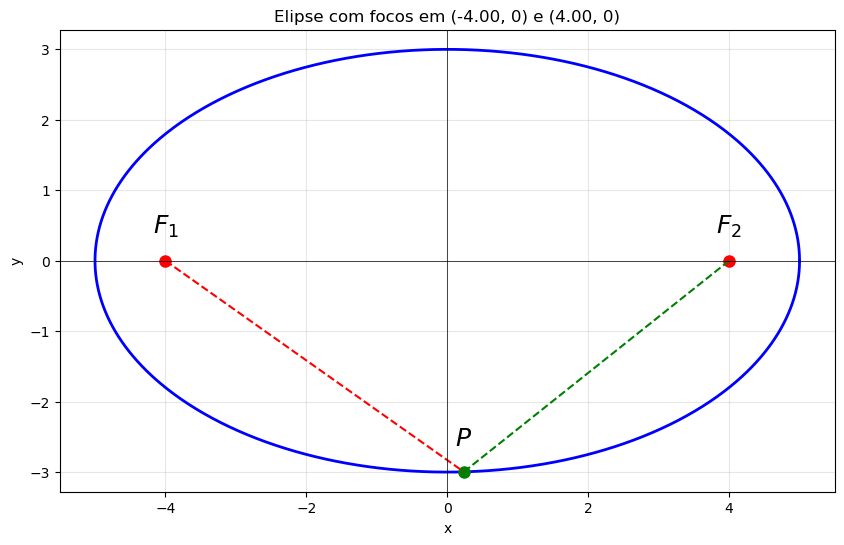{width=50% fig-align="center"}

:::{#def-}
A elipse com focos em $F_1$ e $F_2$ é o lugar geométrico dos pontos $P$ tais que a soma das distâncias a $F_1$ e $F_2$ é constante:
$$
\|\vec{PF_1}\| + \|\vec{PF_2}\| = 2a,
$$
onde $2a$ é o eixo maior da elipse.
:::
:::
:::{.fragment .current-visible}
{width=50% fig-align="center"}

A equação da elipse com focos em $F_1=(-c,0)$ e $F_2=(c,0)$ e eixo maior $2a$ é
$$
\frac{x^2}{a^2} + \frac{y^2}{b^2} = 1,
$$
onde $b^2 = a^2 - c^2$.
:::
:::{.fragment .current-visible}
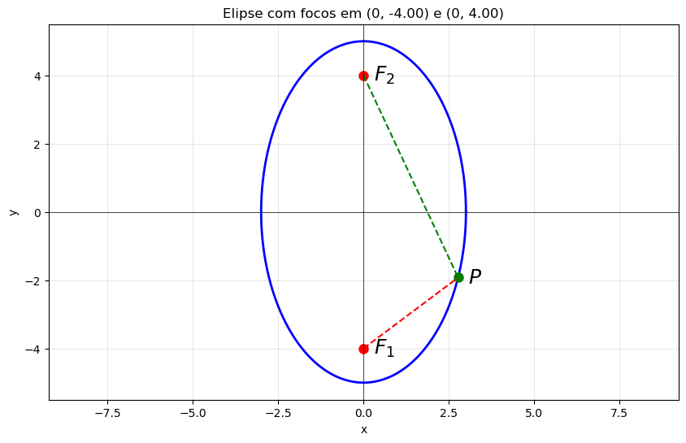{width=50% fig-align="center"}

A equação da elipse com focos em $F_1=(0,-c)$ e $F_2=(0,c)$ e eixo maior $2a$ é
$$
\frac{x^2}{b^2} + \frac{y^2}{a^2} = 1,
$$
onde $b^2 = a^2 - c^2$.
:::
:::

## Hiperbole

:::{.r-stack}
:::{.fragment .current-visible}
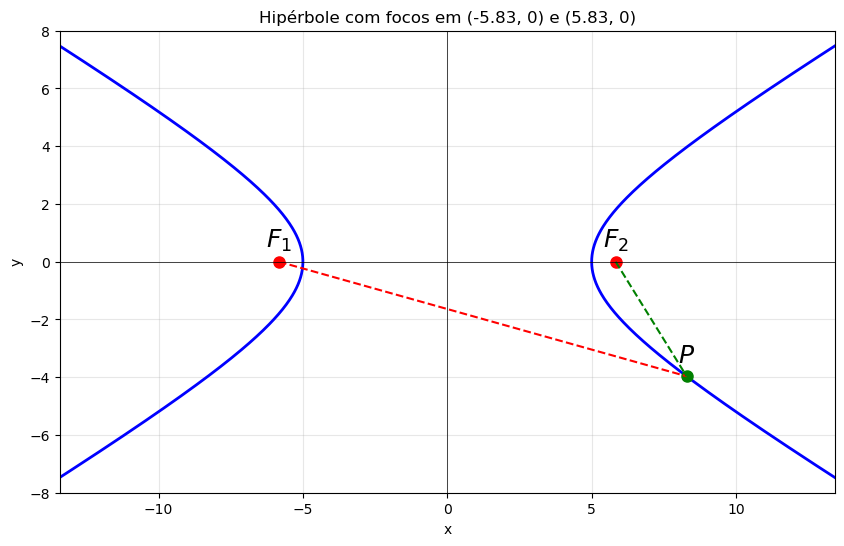{width=50% fig-align="center"}

:::{#def-}
A hipérbole com focos em $F_1$ e $F_2$ é o lugar geométrico dos pontos $P$ tais que o valor absoluto da diferença das distâncias a $F_1$ e $F_2$ é constante:
$$
\left| \|\vec{PF_1}\| - \|\vec{PF_2}\| \right| = 2a,
$$  onde $2a$ é o eixo real da hipérbole.
:::
:::
:::{.fragment .current-visible}
{width=50% fig-align="center"}

A equação da hipérbole com focos em $F_1=(-c,0)$ e $F_2=(c,0)$ e eixo real $2a$ é
$$
\frac{x^2}{a^2} - \frac{y^2}{b^2} = 1,
$$
onde $b^2 = c^2 - a^2$.
:::
:::{.fragment .current-visible}
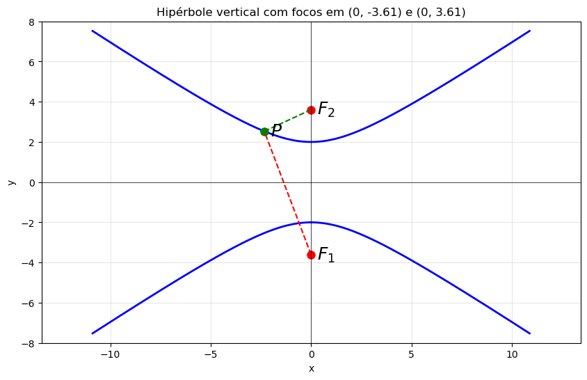{width=50% fig-align="center"}

A equação da hipérbole com focos em $F_1=(0,-c)$ e $F_2=(0,c)$ e eixo real $2a$ é
$$
-\frac{x^2}{b^2} + \frac{y^2}{a^2} = 1,
$$
onde $b^2 = c^2 - a^2$.
:::
:::

## Parábola

:::{.r-stack}
:::{.fragment .current-visible}
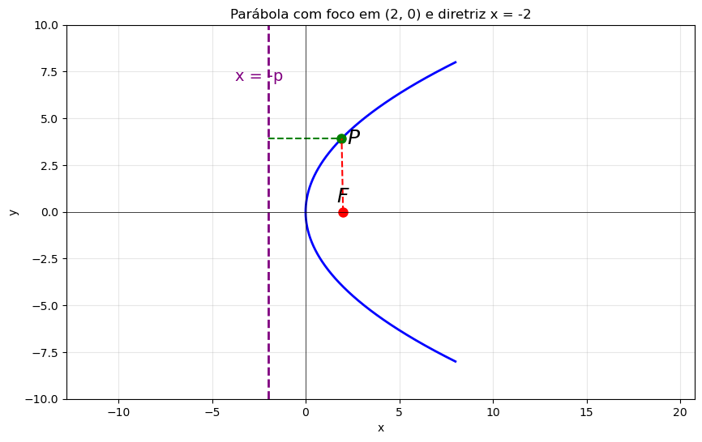{width=50% fig-align="center"}

:::{#def-}
A parábola com foco em $F$ e diretriz $\ell$ é o lugar geométrico dos pontos $P$ tais que a distância a $F$ é igual à distância à reta $\ell$:
$$
\|\vec{PF}\| = \mathrm{dist}(P,\ell).
$$
:::
:::
:::{.fragment .current-visible}
{width=50% fig-align="center"}

A equação da parábola com foco em $F=(p,0)$ e diretriz $x=-p$ é
$$
y^2 = 4px.
$$
:::
:::{.fragment .current-visible}
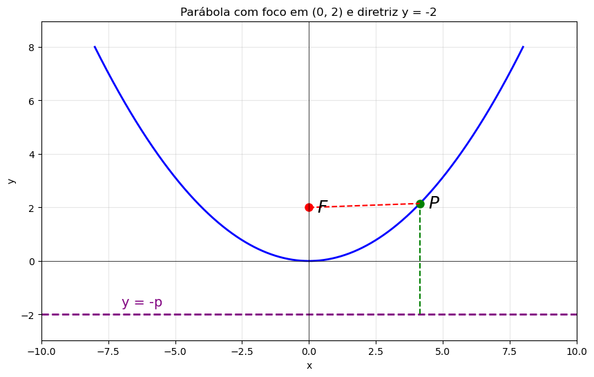{width=50% fig-align="center"}

A equação da parábola com foco em $F=(0,p)$ e diretriz $y=-p$ é
$$
x^2 = 4py.
$$
:::
:::

## Seções cônicas

Estas curvas são chamadas de [seções cônicas]{.bg-yellow} porque podem ser obtidas como interseções de um plano com um cone duplo.

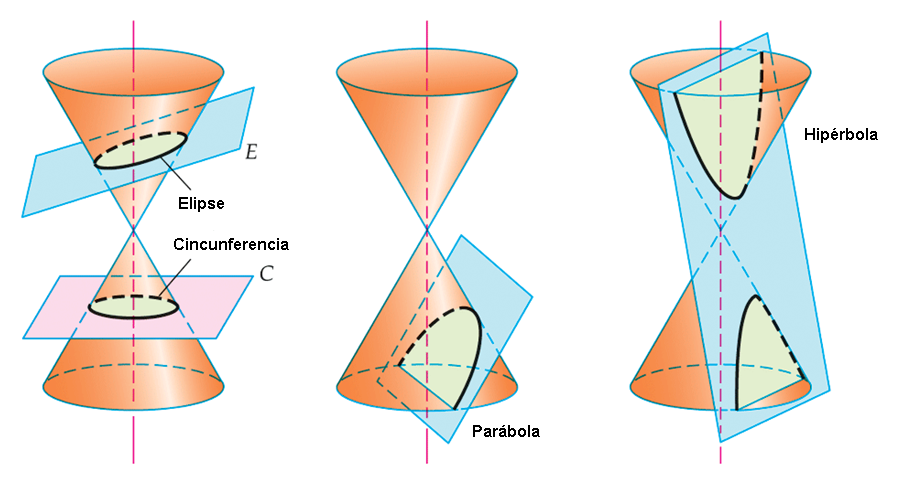{.nostretch width=60% fig-align="center"}

## Equações do segundo grau em duas variáveis

Equações quadráticas em duas variáveis tem a forma geral 
$$
Ax^2 + Bxy + Cy^2 + Dx + Ey + F = 0.
$$

Estas equações determinam uma curva no plano $xy$. Exemplos

::: {#fig-conics layout-ncol=3}
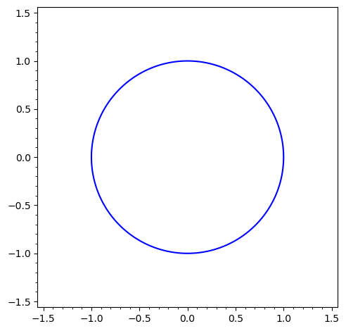{#fig-surus}

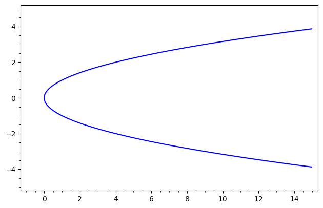{#fig-hanno}

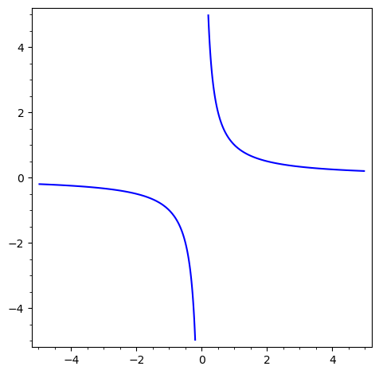{#fig-hanno}
:::

## Exemplos mais complexos

1. $6x^2+9y^2-4xy-4\sqrt{5}x-18\sqrt{5}y-5=0$
2. $9x^2+y^2+6xy-10\sqrt{10}x+10\sqrt{10}y+90=0$
3. $x^2-y^2+2\sqrt{3}xy+6x=0$

::: {#fig-conics-simple layout-ncol=3}
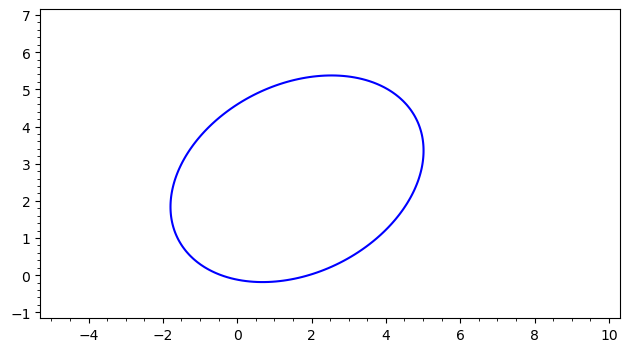{#fig-surus}

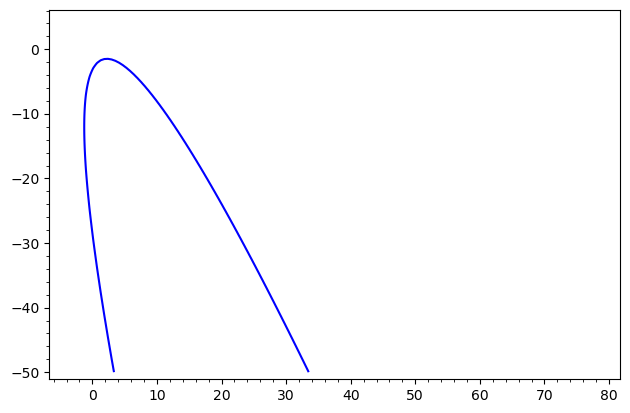{#fig-hanno}

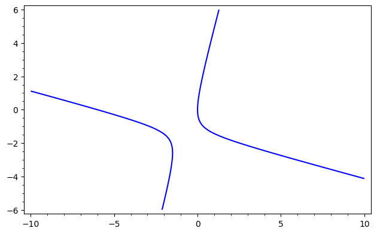{#fig-hanno}
:::

## Exemplos degenerados 

::: {#fig-conics-degen layout-ncol=3}
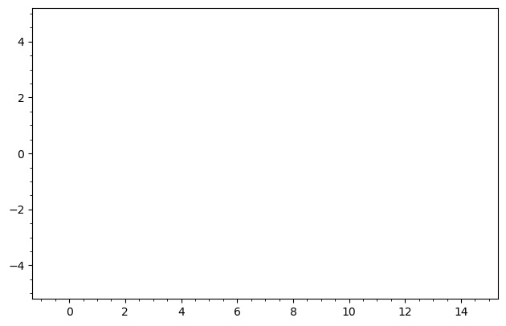{#fig-surus}

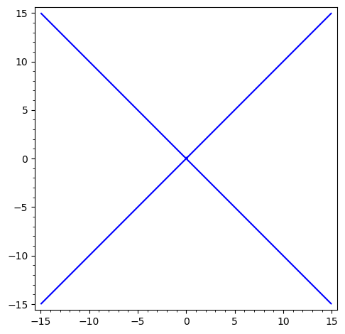{#fig-hanno}
:::

## Seções cônicas e equações quadráticas

É um fato que cada equação quadrática (não degenerada) em duas variáveis representa uma seção cônica.

[Problemas:]{.bg-yellow}

1. Como identificar qual seção cônica é representada por uma equação quadrática?
2. Como obter a equação reduzida da seção cônica a partir da equação quadrática?
3. Fazer mudança de coordenadas para simiplificar a equação quadrática.

## Exemplo 1: Completar os quadrados

:::{.columns}
:::{.column width=40%}
$$
x^2 - 6x + y^2 - 4y + 9 = 0
$$
obtemos

$$ (x-3)^2 + (y-2)^2 = 4 $$

Equação de uma circunferência com centro em $A=(3,2)$ e raio $2$. Está no primeiro quadrante e é tangente ao eixo $x$.
:::
:::{.column width=60%}
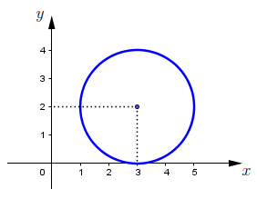{width=80% fig-align="center"}
:::
:::

## Exemplo 2: Completar os quadrados

:::{.columns}
:::{.column width=40%}  
Completando os quadrados em 
$$
x^2 + 8x + y^2 - 6y = 0
$$ obtemos

$$(x+4)^2 + (y-3)^2 = 25 $$
Circunferência com centro em $A=(-4,3)$ e raio $5$. Passa pela origem.
:::
:::{.column width=60%}
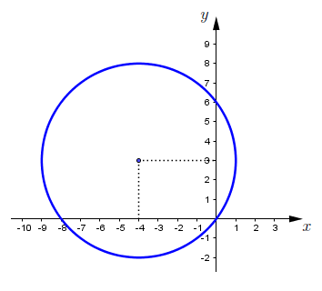{width=80% fig-align="center"}
:::
:::

## Exemplo 3: Parábola

:::{.columns}
:::{.column width=40%}
A curva
\begin{align*}
y &= x^2 + 2x - 3 = (x+3)(x-1) \\&= (x+1)^2 - 4
\end{align*}
é uma parábola côncava para cima, com raízes em $x=-3$ e $x=1$ e vértice em $V=(-1,-4)$.
:::
:::{.column width=60%}
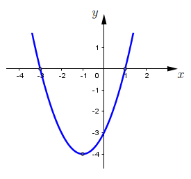{width=80% fig-align="center"}
:::
:::

## Exemplo 4: Parábola

:::{.columns}
:::{.column width=40%}
$$
y = -x^2 + 4x - 4 = -(x-2)^2
$$ 
é uma parábola côncava para baixo, com raiz real $x=2$ e vértice $V=(2,0)$.
:::
:::{.column width=60%}
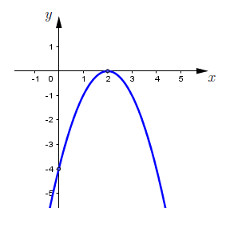{width=80% fig-align="center"}
:::
:::    

## Exemplo 5: Parábola

:::{.columns}
:::{.column width=40%}  
\begin{align*}
x &= y^2 - 4y + 3 = (y-1)(y-3)\\ &= (y-2)^2 - 1.
\end{align*}
Considerando $x$ como função de $y$, o gráfico é uma parábola côncava para a direita, com raízes $y=1$, $y=3$ e vértice $V=(-1,2)$.
:::
:::{.column width=60%}
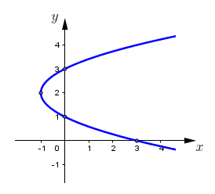{width=80% fig-align="center"}
:::
:::

## Exemplo 6: Parábola

:::{.columns}
:::{.column width=40%}
\begin{align*}
x &= -y^2 - 2y + 8 = -(y+4)(y-2) \\&= -(y+1)^2 + 9.
\end{align*}
Tomando $x$ como função de $y$, parábola côncava para a esquerda, raízes $y=2$, $y=-4$, vértice $V=(9,-1)$.
:::
:::{.column width=60%}
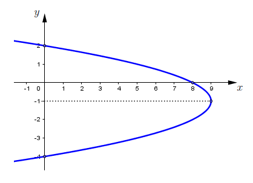{width=80% fig-align="center"}
:::
:::

## Exemplo 7: Elipse

:::{.columns}
:::{.column width=40%}
Completando os quadrados em 
\begin{align*}
4x^2 - 8x + y^2 - 4y + 4 &= 0\\ 
(x-1)^2 + \frac{(y-2)^2}{4} &= 1
\end{align*}
Elipse centrada em $A=(1,2)$, semieixo horizontal $a=1$ e vertical $b=2$. Está no primeiro quadrante e tangente aos eixos.
:::
:::{.column width=60%}
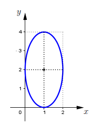{width=70% fig-align="center"}
:::
:::

## Exemplo 8: Elipse

:::{.columns}
:::{.column width=40%}
Completando os quadrados em 
$$
4x^2 + 24x + 9y^2 + 36y + 36 = 0
$$ 
obtemos

$$ \frac{(x+3)^2}{9} + \frac{(y+2)^2}{4} = 1 $$

Elipse centrada em $A=(-3,-2)$, semieixo horizontal $a=3$ e vertical $b=2$. Está no terceiro quadrante e tangente aos eixos.
:::
:::{.column width=60%}
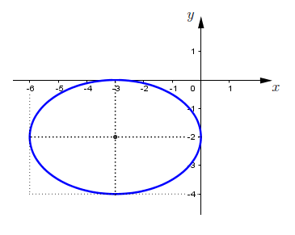{width=80% fig-align="center"}
:::
:::

## Exemplo 9: Elipse

:::{.columns}
:::{.column width=40%}
Completando os quadrados em 
$$9x^2 + 72x + 16y^2 = 0$$ obtemos

$$ \frac{(x+4)^2}{16} + \frac{y^2}{9} = 1 $$

Elipse centrada em $A=(-4,0)$, semieixo horizontal $a=4$ e vertical $b=3$. Passa pela origem e é tangente ao eixo $y$.
:::
:::{.column width=60%}
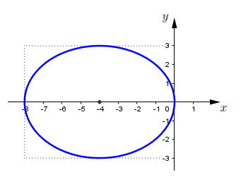{width=80% fig-align="center"}
:::
::::

## Exemplo 10: Elipse

:::{.columns}
:::{.column width=40%}
Completando os quadrados em $$3x^2 - 12x + 4y^2 + 24y = 0$$ obtemos

$$ \frac{(x-2)^2}{16} + \frac{(y+3)^2}{12} = 1 $$
Elipse centrada em $A=(2,-3)$, semieixo horizontal $a=4$ e vertical $b=\sqrt{12}$. Passa pela origem, intersecta eixo $x$ em $(4,0)$ e eixo $y$ em $(0,-6)$.
:::
:::{.column width=60%}
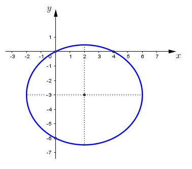{width=80% fig-align="center"}
:::
:::

## Exemplo 11

:::{.columns}
:::{.column width=40%}
Completando os quadrados em $$x^2 + 4x - y^2 + 2y - 1 = 0$$ obtemos

$$ \frac{(x+2)^2}{4} - \frac{(y-1)^2}{4} = 1 $$

Hipérbole centrada em $A=(-2,1)$ com focos sobre $y=1$. Retas assíntotas: $y=x+3$ e $y=-x-1$.
:::
:::{.column width=60%}
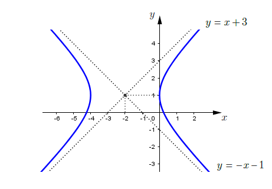{width=80% fig-align="center"}
:::
:::

## Exemplo 12

:::{.columns}
:::{.column width=40%}
Completando os quadrados em $$x^2 - 4x - 4y^2 + 8 = 0$$ obtemos

$$ -\frac{(x-2)^2}{4} + y^2 = 1 $$

Hipérbole centrada em $A=(2,0)$ com focos sobre $x=2$. Assíntotas: $y=\frac{x}{2}-1$ e $y=-\frac{x}{2}+1$.
:::
:::{.column width=60%}
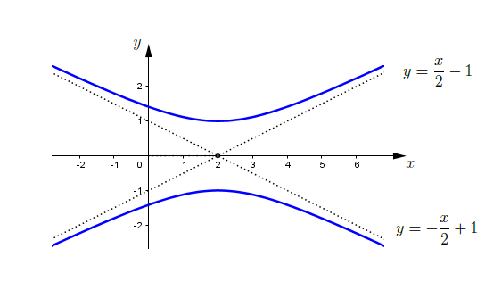{.nostretch width=80% fig-align="center"}
:::
:::

## Exemplos com termo misto

Os exemplos anteriores não possuem o termo misto $Bxy$ e isso simplifica a análise. A seguir temos exemplos com termo misto.

Considere por exemplo a equação
$$
3x^2+2\sqrt{3}xy+y^2+2x-2\sqrt{3}y=0.
$$
Note que temos o termo misto $2\sqrt{3}xy$. Para eliminar este termo misto, escrevemos a equação na forma 
matricial: 
$$
\begin{bmatrix}x & y
\end{bmatrix}
\begin{bmatrix}3 & \sqrt{3} \\
\sqrt{3} & 1
\end{bmatrix}
\begin{bmatrix}x \\ y
\end{bmatrix}+
\begin{bmatrix}2 & -2\sqrt{3}
\end{bmatrix}
\begin{bmatrix}x \\ y
\end{bmatrix}=X^t A X+KX=0
$$
onde 
$$
X=\begin{bmatrix}x \\ y
\end{bmatrix},\quad
A=\begin{bmatrix}3 & \sqrt{3} \\
\sqrt{3} & 1
\end{bmatrix},\quad
K=\begin{bmatrix}2 & -2\sqrt{3}
\end{bmatrix}.
$$

## Diagonalização da matriz $P$

Note que a matriz $A$ é simétrica. Podemos diagonalizá-la usando uma matriz ortogonal $P$ tal que
$$
P^t A P = D,
$$
onde $D$ é uma matriz diagonal. As colunas de $Q$ são os autovetores de $P$ e os elementos da diagonal de $D$ são os autovalores de $P$.

Calculando os autovalores e autovetores de $P$ obtemos
$$
P = \begin{bmatrix}
\sqrt{3}/{2} & -1/2 \\
1/2 & \sqrt{3}/2
\end{bmatrix},\quad
D = \begin{bmatrix}4 & 0 \\
0 & 0
\end{bmatrix}.
$$  
A matriz $P$ representa uma rotação de $30^\circ$ no sentido anti-horário.  

Daqui, obtemos que 
$$
A=P D P^t.
$$

## Mudança de coordenadas

Seja 
$$
X'=\begin{bmatrix}x' \\ y'\end{bmatrix}=P^t X=\begin{bmatrix}
\sqrt{3}/{2} & 1/2 \\
-1/2 & \sqrt{3}/2
\end{bmatrix}\begin{bmatrix}x \\ y\end{bmatrix}=\begin{bmatrix}
\sqrt{3}/2 x + 1/2 y \\
-1/2 x + \sqrt{3}/2 y
\end{bmatrix}.
$$

A equação quadrática pode ser escrita como
\begin{align*}
0&=3x^2+2\sqrt{3}xy+y^2+2x-2\sqrt{3}y\\
&=X^t A X + K X 
=X^t P D P^t X + K P P^t X \\
&=(P^tX)^t D (P^t X) + K P(P^t X)
={X'}^t D X' + K' X',
\end{align*}
onde $K' = K P$. Calculando $K'$ obtemos
$$
K' = \begin{bmatrix}0  & -4
\end{bmatrix}.
$$
Assim, a equação quadrática na nova base é
$$
4{x'}^2 -4 y' = 0\quad  \Rightarrow \quad y'={x'}^2.
$$
Esta é a equação de uma parábola para cima, com vértice na origem.

## Interpretação geométrica

A curva no exemplo anterior foi caraterizada pelas equações 
\begin{align*}
3x^2+2\sqrt{3}xy+y^2+2x-2\sqrt{3}y&=0\\
y' &= {x'}^2
\end{align*}

A parábola pode ser visualisada no seguinte gráfico:

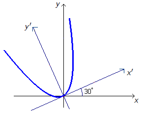{.nostretch width=40% fig-align="center"}

## Diagonalização

**Por que o interesse em diagonalizar matrizes simétricas?**

Temos por objetivo caracterizar e desenhar o conjunto solução de uma equação geral do segundo grau em duas variáveis

$$ax^2 + bxy + cy^2 + dx + ey = f$$

Esta equação pode ser escrita na forma

$$\left[\begin{array}{cc} x & y \end{array}\right]
\left[\begin{array}{cc} a & \frac{b}{2} \\ \frac{b}{2} & c \end{array}\right]
\left[\begin{array}{c} x \\ y \end{array}\right]\ +\ 
\left[\begin{array}{cc} d & e \end{array}\right]
\left[\begin{array}{c} x \\ y \end{array}\right]\ =\ f$$

Observe que o fator $b$ atrapalha pois se $b \neq 0$ obtemos uma equação com o termo $xy$ que dificulta a análise.

## Equação geral do segundo grau

$$ax^2 + bxy + cy^2 + dx + ey = f$$

Pode ser escrita na forma

$$\left[\begin{array}{cc} x & y \end{array}\right]
\left[\begin{array}{cc} a & \frac{b}{2} \\ \frac{b}{2} & c \end{array}\right]
\left[\begin{array}{c} x \\ y \end{array}\right]\ +\ 
\left[\begin{array}{cc} d & e \end{array}\right]
\left[\begin{array}{c} x \\ y \end{array}\right]\ =\ f$$

Chamando

$$A = \left[\begin{array}{cc} a & \frac{b}{2} \\ \frac{b}{2} & c \end{array}\right] \ \ \ \ \ 
X = \left[\begin{array}{c} x \\ y \end{array}\right]  \ \ \ \ \ 
K = \left[\begin{array}{cc} d & e \end{array}\right]$$

a equação também pode ser escrita na forma resumida

$$\boxed{X^t A X + KX = f}$$

## Equação geral do segundo grau

$$ax^2 + bxy + cy^2 + dx + ey = f$$

Pode ser escrita na forma resumida

$$\boxed{X^t A X + KX = f}$$

Como $A$ é uma matriz **simétrica**, existe uma matriz ortogonal $P$, cujas colunas são vetores ortogonais e unitários, e existe uma matriz diagonal $D$ tais que 

$$\boxed{A=PDP^t}$$

Substituindo na equação geral dada, obtemos

$$X^t (PDP^t) X + KX = f$$
$$(X^tP) D (P^tX) + KX = f$$
$$(P^tX)^t D (P^tX) + KP(P^tX) = f$$

## Equação geral do segundo grau

$$(P^tX)^t D (P^tX) + KP(P^tX) = f$$

Fazemos agora a mudança de variáveis $X'= \left[\begin{array}{c} x' \\ y' \end{array}\right]$ tal que 

$$\boxed{X' = P^tX}\ \ \ {\rm e}\ \ \ \boxed{PX' = X}$$

Substituindo na equação acima, vemos que a equação geral do segundo grau fica expressa do seguinte modo nas variáveis $x'$ e $y'$.

$$\boxed{ {X'}^t D X' + KP X' = f}$$

Observe que esta é uma equação geral do segundo grau nas variáveis $x'$ e $y'$. Mas agora a matriz $D$ é diagonal e portanto nesta equação não aparece a parcela $x'y'$.

Portanto, no sistema de coordenadas $(x',y')$ a equação passa a ter uma expressão mais simples.

## Lembre-se: rotação do sistema de coordenadas

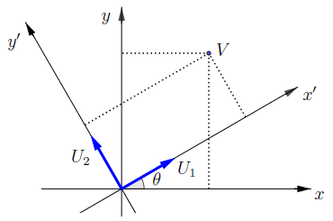{.nostretch width=50% fig-align="center"}

$$P X' = X \ \ \ \Rightarrow \ \ \ \left[\begin{array}{cr} \cos\theta & -\operatorname{sen}\theta \\ \operatorname{sen}\theta & \cos\theta \end{array}\right]
\left[\begin{array}{cc} x' \\ y' \end{array}\right]\ =\ 
\left[\begin{array}{cc} x \\ y \end{array}\right]$$

- a primeira coluna de $P$ é o vetor $U_1=(\cos\theta,\operatorname{sen}\theta)$ que aponta para o eixo $x'$ positivo. 
- a segunda coluna de $P$ é o vetor $U_2=(-\operatorname{sen}\theta,\cos\theta)$ que aponta para o eixo $y'$ positivo.

## Segundo exemplo detalhado

**Exemplo.** Use a teoria de diagonalização para simplificar a seguinte equação e faça um esboço do conjunto solução.

$$8x^2 - 12xy + 17y^2 - 8\sqrt{5}x - 4\sqrt{5}y = 0$$

Matricialmente a equação dada tem a forma

$$\left[\begin{array}{cc} x & y \end{array}\right]
\left[\begin{array}{rr} 8 & -6 \\ -6 & 17 \end{array}\right]
\left[\begin{array}{c} x \\ y \end{array}\right]\ +\ 
\left[\begin{array}{cc} -8\sqrt{5}  & -4\sqrt{5} \end{array}\right]
\left[\begin{array}{c} x \\ y \end{array}\right]\ =\ 0$$

Precisamos diagonalizar a matriz

$$A = \left[\begin{array}{rr} 8 & -6 \\ -6 & 17 \end{array}\right]$$

Para isso, calcule matriz diagonal $D$ e matriz ortogonal $P$ que diagonalizam $A$.

## Segundo exemplo detalhado

$\bullet$ Polinômio característico 

$$p(\lambda) = \det \left[ \begin{array}{cc} 8-\lambda & -6 \\ -6 & 17-\lambda \end{array} \right] =
 \lambda^2 - 25\lambda + 100$$

$\bullet$ Autovalores. $p(\lambda) =  \lambda^2 - 25\lambda + 100 = 0$ $\Leftrightarrow$ $\lambda=5$ e $\lambda=20$.

$\bullet$ Autovetores para $\lambda=5$.

$$\left[ \begin{array}{rr}  3 & -6 \\ -6 & 12 \end{array} \right]\begin{bmatrix} x \\ y \end{bmatrix} = \begin{bmatrix}0 \\ 0 \end{bmatrix}$$

Nesse caso obtemos a reta de equação $y=x/2$.

$\bullet$ Autovetores para $\lambda=20$.

$$\left[ \begin{array}{rr}  -12 & -6 \\ -6 & -3 \end{array} \right]\begin{bmatrix} x \\ y \end{bmatrix} = \begin{bmatrix}0 \\ 0 \end{bmatrix}$$

Nesse caso obtemos a reta perpendicular, de equação $y=-2x$.

## Segundo exemplo detalhado

$\bullet$ Vetores unitários nas direções destas retas são 

$$U_1\ =\ \left[\begin{array}{c} 2\sqrt{5}/5\\ \\ \sqrt{5}/5 \end{array}\right]\ \ \ \ \ \ \ \ 
U_2\ =\ \left[\begin{array}{c} -\sqrt{5}/5\\ \\ 2\sqrt{5}/5 \end{array}\right]$$

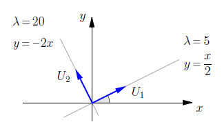{.nostretch width=40% fig-align="center"}

- $U_1$ é a primeira coluna de $P$. Aponta para eixo $x'$ positivo.
- $U_2$ é a segunda coluna de $P$. Aponta para eixo $y'$ positivo

## Segundo exemplo detalhado

$\bullet$ Matrizes $P$ e $D$ que diagonalizam $A$.

$$D = \left[\begin{array}{cc} 5 & 0\\ 0 & 20 \end{array}\right] \ \ \ \ \ \ \ \ \ \ 
P = \left[\begin{array}{ccc}
2\sqrt{5}/5 & & -\sqrt{5}/5\\ \\ 
\sqrt{5}/5 & & 2\sqrt{5}/5 \end{array}\right]$$

$\bullet$ Efetuando a mudança de coordenadas $X'= \left[\begin{array}{c} x' \\ y' \end{array}\right]$ tal que 
$X' = P^tX$ sabemos que a equação quadrática dada passa a ter a forma
${X'}^t D X' + KP X' = 0$ no sistema de coordenadas $x'y'$. Substituindo as matrizes calculadas, obtemos 

$$\hspace{-0.5cm}\left[\begin{array}{cc} x' & y' \end{array}\right]
\left[\begin{array}{cc} 5 & 0 \\ 0 & 20 \end{array}\right]
\left[\begin{array}{c} x' \\ y' \end{array}\right]\ +\ 
\left[\begin{array}{cc} -8\sqrt{5}  & -4\sqrt{5}  \end{array}\right]
\left[\begin{array}{ccc}
2\sqrt{5}/5 & & -\sqrt{5}/5\\ \\ 
\sqrt{5}/5 & & 2\sqrt{5}/5 \end{array}\right]
\left[\begin{array}{c} x' \\ y' \end{array}\right] = 0$$ 

## Segundo exemplo detalhado

$\bullet$ Efetuando as multiplicações obtemos $5{x'}^2 + 20{y'}^2 - 20x' = 0$.

Dividindo por 5 e completando os quadrados obtemos a equação 

$$\boxed{\dfrac{(x'-2)^2}{4} + {y'}^2 = 1}$$

Essa é a equação da elipse centrada no ponto $A=(2,0)$, de semieixo horizontal $a=2$ e semieixo vertical $b=1$, representada logo abaixo.

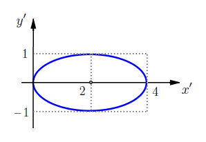{.nostretch width=40% fig-align="center"}

## Segundo exemplo detalhado

$\bullet$ Para representar, no sistema de coordenadas $xy$, o conjunto solução da equação dada nessa questão, basta efetuar uma rotação do gráfico dessa elipse

$$\dfrac{(x-2)^2}{4} + y^2 = 1$$

De modo que os eixos fiquem sobre as retas $y=x/2$ e $y=-2x$. Essa rotação é de aproximadamente $26^o$.

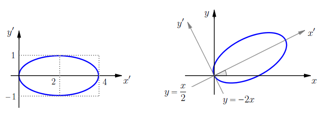{.nostretch width=60% fig-align="center"}

## Os autovalores dizem tudo!

Considere a equação geral do segundo grau em duas variáveis:
\begin{align*}
0&=ax^2 + bxy + cy^2 + dx + ey + f 
=\begin{bmatrix} x &  y  \end{bmatrix} \begin{bmatrix} a & b/2 \\ b/2 & c \end{bmatrix} \begin{bmatrix} x \\ y \end{bmatrix} + \begin{bmatrix} d & e \end{bmatrix} \begin{bmatrix} x \\ y \end{bmatrix} + f\\
&=X^t A X + KX + f
\end{align*}

Seja $P$ a matriz ortogonal que diagonaliza a matriz simétrica
$$
P^t A P = \begin{pmatrix} \lambda_1 & 0 \\ 0 & \lambda_2 \end{pmatrix} 
$$
Onde $\lambda_1$ e $\lambda_2$ são os autovalores de $A$.

Introduzindo as novas coordenadas $X' = P^t X$, a equação geral do segundo grau pode ser escrita como
$$ 
0= \begin{bmatrix} x' & y'\end{bmatrix} \begin{pmatrix} \lambda_1 & 0 \\ 0 & \lambda_2 \end{pmatrix} 
\begin{bmatrix} x' \\ y' \end{bmatrix} + K P X' + f=\lambda_1 {x'}^2 + \lambda_2 {y'}^2 + d'x'+ e'y'+ f'.
$$ 

## Os autovalores dizem tudo!

Introduzindo as novas coordenadas $X' = P^t X$, a equação geral do segundo grau pode ser escrita como
$$ 
0= \begin{bmatrix} x' & y'\end{bmatrix} \begin{pmatrix} \lambda_1 & 0 \\ 0 & \lambda_2 \end{pmatrix} 
\begin{bmatrix} x' \\ y' \end{bmatrix} + K P X' + f=\lambda_1 {x'}^2 + \lambda_2 {y'}^2 + d'x'+ e'y'+ f'.
$$ 
onde $\lambda_1$ e $\lambda_2$ são os autovalores de $A$.

Dependendo dos sinais de $\lambda_1$ e $\lambda_2$, a equação acima representa diferentes seções cônicas:

1. Se $\lambda_1>0$ e $\lambda_2>0$: elipse.
2. Se $\lambda_1<0$ e $\lambda_2<0$: elipse. 
2. Se $\lambda_1>0$ e $\lambda_2<0$: hipérbole.
3. Se $\lambda_1<0$ e $\lambda_2>0$: hipérbole.
4. Se $\lambda_1=0$ ou $\lambda_2=0$: parábola.

Mas tem que cuidado: a equação pode ser degenerada!

## Os autovalores dizem tudo!

Observe que 
$$
\det A =(\det P)^{-1}\cdot \det P\cdot \det A=\det P^t\cdot \det A \cdot \det P = \det D = \lambda_1 \lambda_2.
$$
Portanto o tipo de seção cônica também pode ser determinado pelo sinal do determinante de $A$:

1. Se $\det A > 0$: elipse.
2. Se $\det A < 0$: hipérbole.
3. Se $\det A = 0$: parábola.

Mas tem que cuidado: a equação pode ser degenerada!

:::{#exm-}
No exemplo anterior, temos que 
$$
8x^2 - 12xy + 17y^2 - 8\sqrt{5}x - 4\sqrt{5}y = 0
$$
$\det A = \det \begin{bmatrix} 8 & -6 \\ -6 & 17 \end{bmatrix} = 8\cdot 17 - (-6)^2 = 100 > 0$ e portanto a equação representa uma elipse. 
:::

<!--## Agora é a sua vez

**Exercícios.** Quando necessário, use a teoria de diagonalização para simplificar cada uma das equações a seguir. Faça um esboço do conjunto solução.

1. $(a)$ $x^2 + 2xy + y^2 + \sqrt{2}x - \sqrt{2}y = 0$.
2. $(b)$ $x^2 + 2\sqrt{3}xy + 3y^2 + 2\sqrt{3}x - 2y = 4$.
3. $(c)$ $(x-3)^2 + \dfrac{(y-2)^2}{4} = 1$.
4. $(d)$ $5x^2 - 6xy + 5y^2 = 8$.
5. $(e)$ $x^2 + 4xy + 4y^2 - 3\sqrt{5}x - \sqrt{5}y = 10$.
6. $(f)$ $7x^2 - 6\sqrt{3}xy + 13y^2 + (16 -8\sqrt{3})x - (8 + 16\sqrt{3})y  = -16$.

## Respostas dos exercícios da aula

1. $(a)$ $x^2 + 2xy + y^2 + \sqrt{2}x - \sqrt{2}y = 0$.

Essa equação representa a parábola $y=x^2$ rotacionada de $45^o$.

{.nostretch width=60% fig-align="center"}

## Respostas dos exercícios da aula

1. $(b)$ $x^2 + 2\sqrt{3}xy + 3y^2 + 2\sqrt{3}x - 2y = 4$.

Essa equação representa a parábola $y=x^2-1$ rotacionada de $60^o$.

{.nostretch width=60% fig-align="center"}

## Respostas dos exercícios da aula

1. $(c)$ $(x-3)^2 + \dfrac{(y-2)^2}{4} = 1$.

Essa é a equação de uma elipse centrada em $A=(3,2)$, semieixo horizontal $a=1$ e semieixo vertical $b=2$.
Para essa equação não precisamos aplicar diagonalização, nem efetuar mudança de coordenadas.

{.nostretch width=60% fig-align="center"}

## Respostas dos exercícios da aula

1. $(d)$ $5x^2 - 6xy + 5y^2 = 8$.

Essa é a equação de uma elipse $\ \dps\dfrac{x^2}{4} + y^2 = 1\ $,
centrada na origem, semieixo horizontal $a=2$ e semieixo vertical $b=1$ rotacionada de $45^o$.  

{.nostretch width=60% fig-align="center"}

## Respostas dos exercícios da aula

1. $(e)$ $x^2 + 4xy + 4y^2 - 3\sqrt{5}x - \sqrt{5}y = 10$.

Essa equação representa a parábola $y = -x^2 + x + 2$ rotacionada de modo que os eixos $x$ e $y$ fiquem sobre as retas
$y=2x$ e $y=-\dfrac{1}{2}x$. A rotação é de aproximadamente $63^o$.

{.nostretch width=60% fig-align="center"}

## Respostas dos exercícios da aula

1. $(f)$ $7x^2 - 6\sqrt{3}xy + 13y^2 + (16 -8\sqrt{3})x - (8 + 16\sqrt{3})y  = -16$.

Essa equação representa a elipse $\ \dps \dfrac{(x-2)^2}{4} + (y-1)^2 = 1 $ centrada em $A=(2,1)$,
semieixo horizontal $a=2$ e semieixo vertical $b=1$, rotacionada de $30^o$.

{.nostretch width=60% fig-align="center"}

-->